# Agentic AI Implementation and Lifecycle Governance

## Executive overview

| | |
|---|---|
| Document | Executive overview of the governance framework |
| Version | 1.0 · September 2026 |
| Author | Andres Gavriljuk |
| Based on | [Agentic AI Implementation and Lifecycle Governance](Agentic_AI_Implementation_and_Lifecycle_Governance.md), version 1.1 |
| Intended readers | Part I: accountable owners and builders of AI, IT Director, CISO, business leadership · Part II: AI governance, Risk, Compliance and Legal, Data Protection Officer, Internal Audit |
| Licence | [Creative Commons Attribution-NonCommercial 4.0 International](https://creativecommons.org/licenses/by-nc/4.0/) (CC BY-NC 4.0) |

**Purpose.** This overview presents the framework for governing agentic AI across its lifecycle in condensed form.
The full framework remains the authoritative text; each section names the part of the framework where the detail is
set out.

**Structure.** The *Summary* presents the framework on one page. **Part I, the lifecycle in practice,** answers the
questions of those who build, buy, own, operate or secure AI: what is governed, what is required to deploy a new AI
system or agent, and what is required when it changes. **Part II, the governance model,** sets out how the framework
decides and controls: the operating model, the method that determines the level of governance, the testing
standard, monitoring and incidents, the principles and safeguards, the supporting technology, regulatory alignment and
the roadmap. Each section opens with a summary (*In brief*), followed by figures and reference tables. Figures 1, 4
and 14 are drawn for this overview; the others are the framework's figures, and the section numbers inside them refer
to the framework.

**Reading paths**

| Reader | Sections |
|---|---|
| Business leadership | Summary · 2 · 6 · 15 · 16 |
| Accountable owners and builders of AI | Summary · Part I (sections 1 to 7) |
| IT Director, Technology and Architecture | Summary · Part I · 13 Supporting technology · 15 Roadmap |
| CISO and the AI security team | Summary · Part I · 8 Operating model · 10 Testing standard · 11 Monitoring and incidents · 12 Safeguards · 13 Security of the governance solution |
| Data Protection Officer | Summary · Part I · 9.5 Data protection route · 13 Privacy of the governance solution |
| AI governance, Risk, Compliance and Legal | The whole overview, and the framework for the detail |
| Internal Audit | Summary · 2 · 8 · 11 · 12 · 14 |

Words in [square brackets] are placeholders for the organisation's own names of committees, functions and tools.

---

## Summary

The use of AI has moved from a small number of projects each year to agents built continuously, by many people, on
several platforms. Agents do more than answer questions: they call tools, read and write data, and initiate
processes. They are assembled from shared components (a platform, a model, connectors, skills, knowledge sources),
and those components change independently of the agent, often without its owner's knowledge.

Governance designed for occasional AI projects does not provide assurance under these conditions. Registers
maintained by hand become outdated; the same facts are entered into a questionnaire, a register, a risk template and a
GRC tool; self-declared answers determine the level of scrutiny; and an approval, once given, does not reveal later
changes to instructions, models or tools.

The framework establishes **one lifecycle for every AI asset**, with defined decisions, owners and evidence,
proportionate to risk. Responsibility is organised in **three pillars**: *Adopt* builds and runs, *Defend* tests and
protects, *Govern* approves and oversees. The framework is designed to be operated with automated technology rather
than documents and e-mail, and does not assume a particular product.

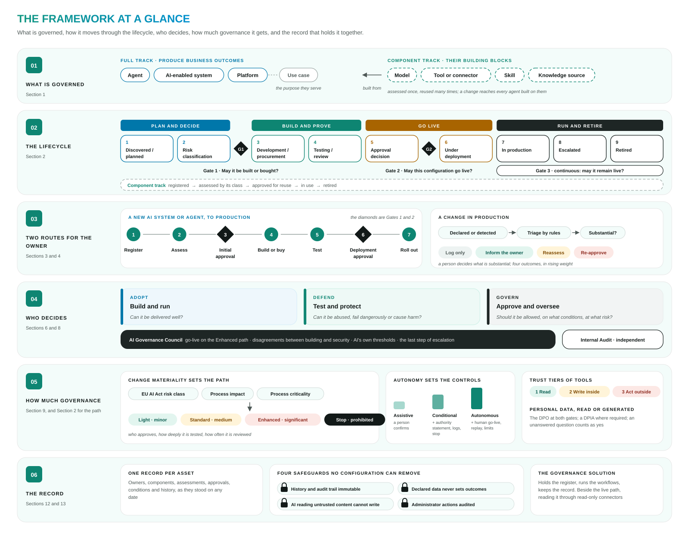

*Figure 1. The framework at a glance: what is governed, the lifecycle, the owner's two routes, who decides, how much governance an asset gets, and the record, each with the section of this overview that describes it.*

**The framework at a glance**

| Element | Number | Content | Section |
|---|---|---|---|
| Asset classes | 8 | Agent · AI-enabled system · platform · model · tool or connector · skill · use case · knowledge source | 1 |
| Tracks | 2 | The full track for assets that produce business outcomes; the component track for their building blocks | 2 |
| Lifecycle | 9 stages, 3 gates | Gate 1: may it be built or bought? · Gate 2: may this configuration go live? · Gate 3: may it remain live? | 2 |
| Steps to production | 7 | Register · assess · initial approval · build or buy · test · deployment approval · roll out | 3 |
| Outcomes of a change | 4 | Log only · inform the owner · reassess · re-approve | 4 |
| Pillars | 3 and a council | Adopt (build and run) · Defend (test and protect) · Govern (approve and oversee) · AI Governance Council | 6, 8 |
| Change materiality | 3 inputs, 4 paths | EU AI Act risk class, process impact, process criticality → Light · Standard · Enhanced · Stop | 2, 9 |
| Levels of autonomy | 3 | Assistive · conditional · autonomous, each with minimum controls | 9 |
| Trust tiers of tools | 3 | Read · write inside the organisation · act outside it | 9 |
| Classes of harm tested | 4 | Technical · operational · societal · systemic | 10 |
| Safeguards and protections | 4 and 3 | Four safeguards that no configuration can remove; three protections that are on by default and visible when off | 12 |
| Implementation phases | 6 | Align · choose the technology · set up · pilot · discover · full lifecycle | 15 |

**Key messages**

1. **Governance centres on the assets that produce outcomes.** Agents, AI-enabled systems and platforms take the
   full lifecycle. Models, tools, skills and knowledge sources are their building blocks: assessed once, reused many
   times, and governed through their uses.
2. **One lifecycle, three decisions:** the initial approval (may it be built or bought?), the deployment approval (may
   this configuration go live?), and continuous oversight in production (may it remain live?).
3. **The go-live requirements are known at the start.** The initial approval sets the path, the controls and the test
   scope before money is spent.
4. **An approval applies to a configuration.** Planned change is declared before it is made; other change is
   detected; a substantial modification is assessed and approved again.
5. **Governance effort is proportionate to risk.** The change materiality determines the path; the level of autonomy
   determines the minimum controls.
6. **Building, testing and approving are separate.** Whoever builds an asset does not validate it, and neither
   approves it. Security is tested by an AI security team and challenged independently by the CISO.
7. **Information is collected rather than submitted.** What an AI platform can report is read from it; what people
   declare is verified against what is discovered; routine outcomes are settled by rule and recorded.
8. **Each asset has one record, which cannot be rewritten.** Every fact, decision and change is kept with who, when
   and on what evidence, and can be produced as it stood on any date.

*Section 16 describes how an organisation can adopt the framework.*

*Framework: section 1.*

---

# Part I — The lifecycle in practice

Part I is written for those who build, buy, own, operate or secure AI, and for their management. It answers two
questions: **what is required to deploy a new AI system or agent** (section 3), and **what is required when it
changes** (section 4).

---

## 1. What is governed

**In brief.** The framework covers every AI asset that the organisation builds, buys or uses in its business. The
register distinguishes eight classes. Agents, AI-enabled systems and platforms produce business outcomes and take the
full lifecycle; models, tools, skills and knowledge sources are their building blocks and take a shorter component
track. An agent is assembled from such components, each an asset with its own owner, and the connections between them
are part of the record: a change to a shared component reaches every agent built on it.

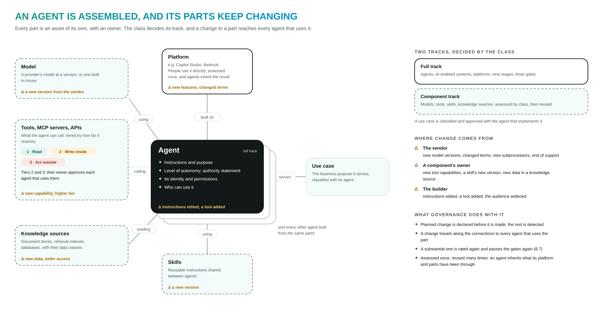

*Figure 2. An agent and its parts. The platform, model, tools, skills and knowledge sources are assets in their own
right, each with an owner; a solid border marks the full track, a dashed one the component track. Change comes from
vendors, component owners and builders, and travels along the connections. (Framework, Figure 2.)*

**The eight classes**

| Class | Definition | Example | Track |
|---|---|---|---|
| **Agent** | A custom agent or AI workflow built by or for the organisation, usually on a platform | A Copilot Studio agent that answers HR questions; a Bedrock agent that reads incoming documents | Full |
| **AI-enabled system** | A software product with AI capabilities, or a ready-made agentic system | A CRM with built-in AI features; GitHub Copilot | Full |
| **Platform** | A general-purpose AI platform that people use directly or build agents on | Microsoft 365 Copilot and Copilot Studio; ChatGPT Enterprise; AWS Bedrock | Full |
| **Model** | A foundation, fine-tuned or classical machine-learning model | A version of a large language model; an in-house scoring model | Component |
| **Tool or connector** | Something an agent can call: an MCP server, an API, a connector | A CRM connector; an action that sends e-mail | Component |
| **Skill** | A reusable package of instructions or capability shared between agents | A "summarise a credit memo" skill | Component |
| **Knowledge source** | What an AI reads to answer: document stores, retrieval (RAG) indexes, databases | An index of internal policies | Component |
| **Use case** | The business purpose that an agent or system serves | First-line triage of customer requests | Approved with its asset |

**Out of scope [to be confirmed].** An employee's personal-productivity use of an approved general-purpose tool (for
example, asking Copilot to draft an e-mail) is governed by the [acceptable-use policy], not asset by asset; the tool
itself is registered and governed. Software without AI is out of scope.

**Why agents require their own lifecycle**

| Characteristic of agents | Consequence for governance |
|---|---|
| **They act:** they call tools that write, send, pay or trigger processes, sometimes without a person in between | The level of autonomy and the reach of every tool are core facts about every agent |
| **They are assembled** from a platform, a model, tools, skills, knowledge sources and an identity | Dependencies are recorded; the owner of a component has a say in its use |
| **Many people build them, quickly,** on low-code platforms or with coding agents | Registration takes minutes and is largely automatic |
| **They change after approval,** and vendors release new model versions on their own schedule | An approval applies to a specific configuration; planned change is declared, other change is detected |
| **They can be attacked in new ways:** prompt injection, tool misuse, poisoned knowledge, goal hijacking | Security testing against the established AI threat catalogues, before go-live and after change |
| **Regulation applies:** the EU AI Act, GDPR, DORA and sector supervision | For any asset and any date, the organisation can show what applied, what was decided, by whom and on what evidence |

**Key terms**

| Term | Meaning |
|---|---|
| **Accountable owner** | The business person accountable for the asset's purpose, use and risks; completes the assessments and requests the approvals |
| **Technical owner** | The person who builds or operates the asset and keeps its configuration and documentation current |
| **Component owner** | The owner of a tool, knowledge source, platform or model, who decides on its use by other assets where its policy requires |
| **Level of autonomy** | *Assistive* (a person confirms every output), *conditional* (it acts within limits while a person monitors) or *autonomous* (limited or delayed human review) |
| **Agent Authority Statement** | What an agent may access, decide and execute, and when it must hand over to a person |
| **Trust tier** | How far a tool or MCP server reaches: *1* read, *2* write inside the organisation, *3* act outside it |
| **Change materiality** | *Minor*, *medium* or *significant*; it determines the path (section 2) |
| **Substantial modification** | A change that alters the purpose, the level of autonomy, the people affected, the data sources, the model or the documented controls (section 4) |
| **Asset dossier** | The complete record of an asset, generated from the register and available for any date |

*Framework: sections 2 and 3, and Appendix A.*

---

## 2. The lifecycle at a glance

**In brief.** Every asset stands at one stage of one lifecycle. The full track has nine stages in four phases, with
three gates; components take a shorter track. At the first gate, three facts about the asset give its **change
materiality**, which sets the **path**: Light, Standard or Enhanced. The path determines who approves, how deeply it is
tested and how often it is reviewed. Workflows attached to the stages run the steps and move the asset on.

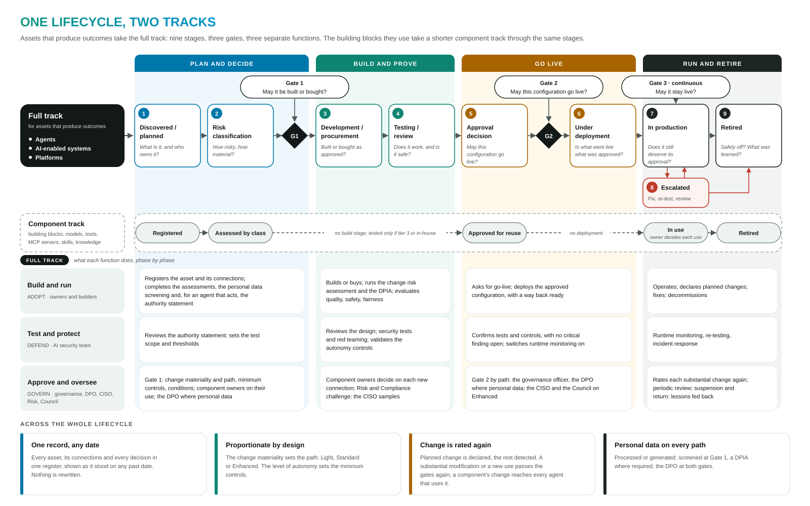

*Figure 3. The full track: nine stages in four phases, three gates, and what each pillar does in each phase. The
component track for the building blocks. Across both, what runs through the whole lifecycle. (Framework, Figure 1.)*

**The nine stages**

| Stage | The question | Who decides | What is recorded |
|---|---|---|---|
| **1 Discovered / planned** | What is it, and who owns it? | — | The asset, its owners, connections and code |
| **2 Risk classification** · Gate 1 | How risky and how material is it? May it be built or bought? | AI Governance Officer; others in parallel | Assessments, risk class, materiality and path, minimum controls, test scope, approvals and conditions |
| **3 Under development / procurement** | Is it built or bought as approved? | Component owners, for their components | Documentation, vendor evidence, access decisions, the DPIA |
| **4 Testing / review** | Does it work, and is it safe? | — | Evidence with its validity |
| **5 Approval decision** · Gate 2 | May this configuration go live, and on what conditions? | The approvers of its path | The approval record: what, by whom, conditions, valid until |
| **6 Under deployment** | Is what went live what was approved? | Owner confirms | The deployed configuration |
| **7 In production** · Gate 3, continuous | Does it still deserve its approval? | Owner; governance on a substantial modification | Changes and their materiality, findings, reviews, re-approvals |
| **8 Escalated** | What is wrong, and what is to be done? | AI Governance Officer; the Council | Escalation, actions, outcome |
| **9 Retired** | Is it safely switched off? | Owner | Retirement; the record remains readable |

**The component track.** A model, tool, skill or knowledge source is registered, assessed on what matters for its
class, and approved for reuse. From then on it is governed through its uses: each agent that connects to it asks its
owner where its policy requires, and each change to it reaches those agents (section 3, *Components*).

**The path.** The owner's answers at Gate 1 give the change materiality from three facts: the **EU AI Act risk class**,
the **process impact** (how much the AI changes the business process: assistive, influencing or transformative) and
the **process criticality** (critical, important or other). The materiality sets the path:

| | **Light** · minor | **Standard** · medium | **Enhanced** · significant |
|---|---|---|---|
| **Initial approval (Gate 1)** | AI Governance Officer; component owners; DPO where personal data | + the AI security team, which sets the test scope | + CISO, Risk, Compliance and Legal |
| **Change risk assessment** | The rating, recorded | Documented with the stakeholders in [the GRC tool] | + a written risk and compliance opinion; review by [the risk committee] and [the management board] |
| **Testing** | The builder's evaluation; a security self-check, sampled by the AI security team | + targeted security tests by the AI security team | + full red teaming |
| **Other evidence at go-live** | The owner's attestation; the DPIA where the screening requires one | + the design of human oversight | + operational resilience measures where a critical process depends on it |
| **Deployment approval (Gate 2)** | AI Governance Officer; may be combined with Gate 1 | + the AI security team | The AI Governance Council, with the CISO's sign-off |
| **From complete registration to Gate 1** | [2 working days] | [5 working days] | [10 working days] |
| **Periodic review** | Every 24 months | Every 12 months | Every 6 months |

A prohibited practice under the EU AI Act is never approved. On every path, the **level of autonomy** adds minimum
controls, and **personal data**, read or generated, involves the DPO. Section 9 sets out the method.

**Roles in the lifecycle**

| Role | Part in the lifecycle |
|---|---|
| **Accountable owner** | Registers, assesses, requests the approvals, meets the conditions, declares changes |
| **Technical owner** | Builds or operates; keeps configuration, connections and documentation current; deploys with a way back |
| **Component owner** | Decides whether an asset may use the component |
| **AI security team** | Sets the test scope; reviews the design; tests security; monitors at runtime; responds to AI incidents |
| **AI Governance Officer** | Reviews and approves at the gates; follows up; escalates |
| **Data Protection Officer** | Approves at both gates where personal data is processed or generated, or where this is not stated |
| **CISO** | Challenges testing independently; signs off the Enhanced path; can stop a go-live on security grounds |
| **AI Governance Council** | Decides go-live on the Enhanced path; resolves disagreements; decides on suspension |

*Framework: sections 7 and 6.2.*

---

## 3. Deploying a new AI system or agent

**In brief.** A new AI system or agent reaches production in seven steps: register, assess, initial approval (Gate 1),
build or buy, test, deployment approval (Gate 2), roll out. The accountable owner leads, with the technical owner.
What is required depends on the path and the level of autonomy, and is known after Gate 1, before the asset is built
or bought.

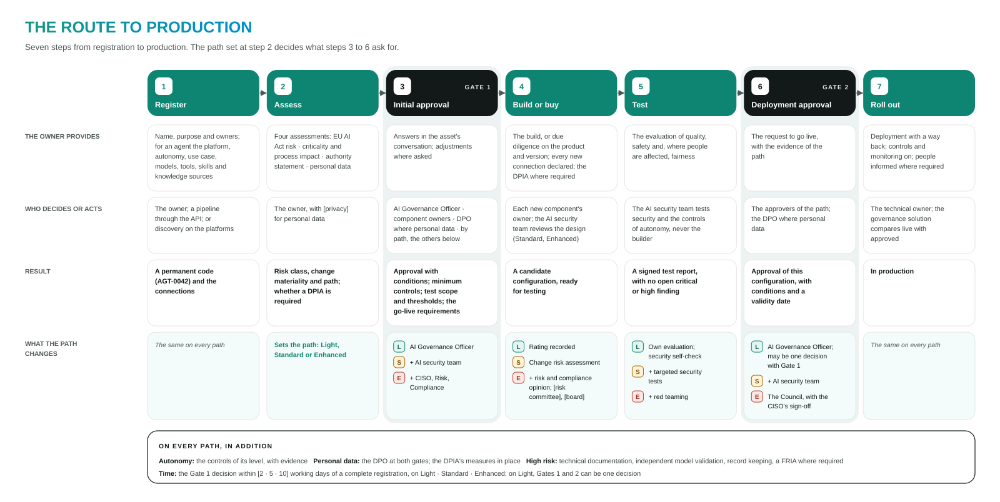

*Figure 4. The route to production: for each of the seven steps, what the owner provides, who decides or acts, the result, and what the path changes.*

**The seven steps**

| Step | The owner | Required | Who decides or acts | Result |
|---|---|---|---|---|
| **1 Register** | Registers the asset: by form, by AI pre-fill from a description or documents, through the API or MCP from a pipeline, or by completing an entry that discovery found. Checks the register for components already approved | Name, purpose, owners, organisation unit; per class the essentials, for an agent: platform, level of autonomy, deployment class, use case, models, tools, skills, knowledge sources; for a bought product: vendor and agreement owner | — | The asset with a permanent code (for example `AGT-0042`) and its connections |
| **2 Assess** | Completes four assessments in parallel (below) | The answers. A fact that is not known is stated as unknown | — | Risk class, change materiality and path; whether a DPIA is required |
| **3 Initial approval** (Gate 1) | Answers questions in the asset's conversation; adjusts the asset where needed | — | AI Governance Officer; owners of the components used; DPO where personal data is involved or not stated; the AI security team (Standard, Enhanced); CISO, Risk, Compliance and Legal (Enhanced) | Approval with conditions; minimum controls; test scope with metrics and thresholds; the go-live requirements |
| **4 Build or buy** | Builds, or carries out due diligence on the product and version; declares every new connection; completes the change risk assessment (Standard, Enhanced) and the DPIA where required | Documentation; for a bought product, vendor evidence, a responsibility matrix, contractual clauses and an exit plan | Each new component's owner; the AI security team reviews the design (Standard, Enhanced) | A candidate configuration ready for testing |
| **5 Test** | Evaluates quality, safety and, where people are affected, fairness; arranges the security tests | The evaluation results | The AI security team tests security and the controls of autonomy; security is never tested by the builder | One signed test report per candidate configuration, with no open critical or high finding |
| **6 Deployment approval** (Gate 2) | Requests go-live | The evidence of the path (below) | The approvers of the path; on Enhanced, the Council with the CISO's sign-off; the DPO where personal data | Approval of **this configuration**, with conditions and a validity date |
| **7 Roll out** | Deploys with a way back ready; switches the controls and monitoring on; informs people that they deal with AI where required; confirms go-live | — | The governance solution compares the live configuration with the approved one | The asset is in production |

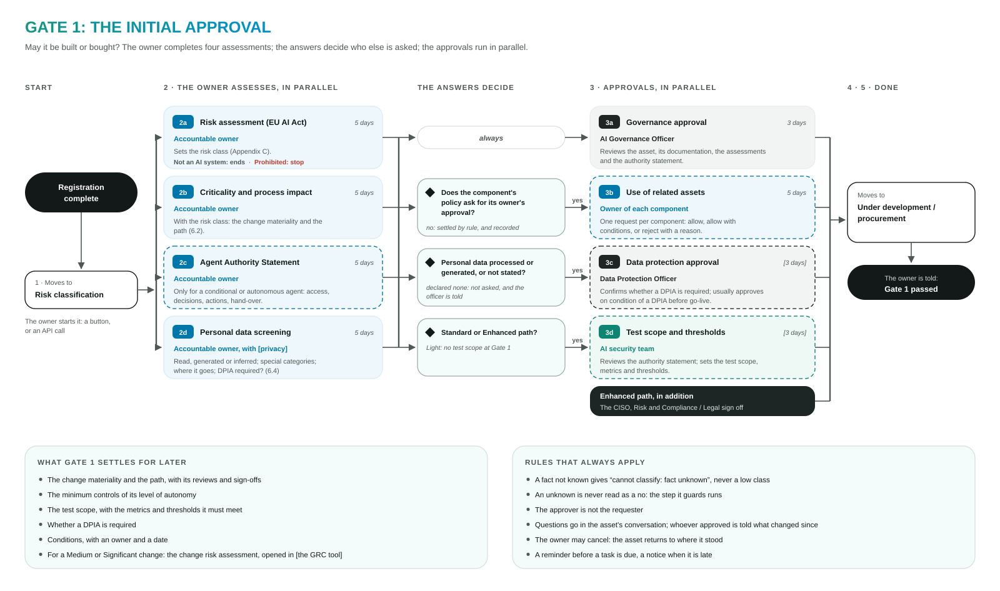

*Figure 5. The owner's four assessments in parallel; the answers decide who else is asked; the approvals in parallel.
(Framework, Figure 8.)*

**The four assessments at step 2**

| Assessment | Content | Result |
|---|---|---|
| **Risk assessment (EU AI Act)** | Four questions: is it an AI system at all; a prohibited practice (Art. 5); a high-risk use (Annex III); interaction with people or content that could mislead them (Art. 50). The form stops as soon as an answer decides | The risk class: prohibited, high, limited or minimal |
| **Criticality and process impact** | The business process served and its criticality; how much the AI changes it; whether it faces customers; how many people use it or are affected; what happens when it fails | With the risk class, the change materiality and the path |
| **Agent Authority Statement** | For a conditional or autonomous agent: what it may access, decide and execute, and when it hands over to a person | Reviewed by the AI security team; binding at go-live |
| **Personal data screening** | Whether it reads, generates or infers personal data; special categories; decisions about people; where the data goes and how long it is kept | Whether the DPO approves and a DPIA is required. **An unanswered question counts as yes** |

**What go-live requires (step 6).** The test report, the change risk assessment and the other evidence of the path
(section 2, *The path*). In addition, on every path: the **controls of the level of autonomy**, with evidence (a conditional agent: authority
statement, logged actions, a way to stop it, the platform's guardrails on; an autonomous agent also: a human go-live
decision, logs that can replay what it did, limits on runaway actions, re-tests on a schedule, a fairness evaluation
where it affects people); where personal data is involved, the **DPIA's measures in place** and the record of
processing linked; for a **high-risk system**, technical documentation, independent validation of the model, record
keeping and a FRIA where required. Where a platform cannot yet provide a control, the approval records the gap as a
condition with an owner and a date.

**Buying rather than building.** A bought product is assessed at its product and version, always with the
organisation's own assessment, including security. Vendor documents are kept as evidence with their validity. Who
controls what depends on the deployment class:

| Deployment class | The vendor controls | Shared | The organisation controls |
|---|---|---|---|
| **Built in-house** | Infrastructure only | — | Model, instructions, data, tools, access, safety, logging |
| **Foundation model through an API** | Training, alignment and infrastructure of the model | Model governance; safety settings | Instructions, data, tools, orchestration, identity and access, logging and monitoring |
| **SaaS or embedded AI** | Model, orchestration, built-in tools, runtime | Safety settings; permitted configuration | Data it can reach, who can use it, identity and access, own monitoring, policy |

**Components.** A component is registered, assessed on what matters for its class and approved for reuse once;
agents built on it inherit the assessment.

| Class | Assessed on | Approved for reuse by | Tested |
|---|---|---|---|
| **Model** | Provider and version; hosting and region; whether the provider keeps or trains on the organisation's data; documentation; end of support | AI Governance Officer, with [Technology] | With the solutions that use it; independently validated in a high-risk solution |
| **Tool, MCP server or API** | Owner; trust tier; what it exposes and to whom; authentication and permissions; who hosts it | Its owner; the AI security team confirms the tier | Tier 1 a check · tier 2 a review · tier 3 or built in-house, security tests |
| **Skill** | What it instructs and which tools it calls; the file scanned for hidden instructions | Its owner; the AI security team where it calls tier 2 or 3 tools | With the agents that use it |
| **Knowledge source** | Data classes; whether retrieval respects users' permissions; how current it is | Its owner; the DPO where it holds personal data | Disclosure tests with the agents that use it |

**Effort and time.** [Targets to be calibrated in the pilot.] The owner's time to register and assess is [under 30
minutes] on Light and [under 2 hours] on Standard, a DPIA excluded; the Gate 1 decision follows a complete
registration within [2], [5] or [10] working days by path. Light needs no meeting; Standard one risk workshop, which
can be held in writing; Enhanced the risk workshop and [the Council]. On the Light path, Gates 1 and 2 can be one
decision.

*Framework: sections 6, 7.3, 8.1 to 8.6 and 11.4; Appendix B.*

---

## 4. When an AI system or agent changes

**In brief.** An approval applies to the configuration that was approved. Planned changes are declared before they
are made; other changes are detected. Rules sort each change into one of four outcomes, and a person decides whether it
is a substantial modification. A substantial modification or a new use is assessed again as a new change and passes
the gates of its path again before the changed configuration goes live. A change to a component reaches every asset
that uses it.

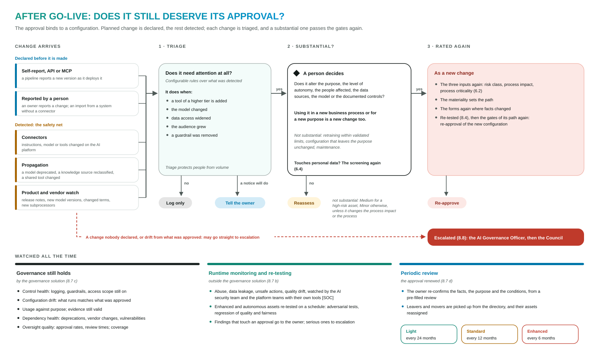

*Figure 6. Change is declared or detected, triaged by rules and judged by a person; a substantial modification or a
new use is rated again and passes the gates again. Beside it, what is monitored continuously. (Framework, Figure 10.)*

**What the owner does**

1. **Declares a planned change before making it**, on the screens or, from a pipeline, through the API. A pipeline can
   ask what a change would mean for the asset's classification and obligations, and whether a version is approved,
   before it deploys.
2. **Acts on the outcome of triage** (below).
3. **For a substantial modification or a new use:** completes the assessments again where facts changed, has the
   changed configuration tested, and obtains approval by its path before it goes live.
4. **Keeps owners, connections and documentation current**, meets the conditions of approval, and confirms the asset
   at each periodic review.

**How changes arrive**

| Channel | Example |
|---|---|
| Declared by the owner or builder | The owner announces a new knowledge source before connecting it |
| Reported by a pipeline through the API or MCP | A pipeline reports a new version as it deploys it |
| Detected by connectors | The agent's instructions, model or tools changed on the platform |
| Propagated through connections | A model the agent uses is deprecated; a knowledge source is reclassified |
| Product and vendor watch | New model versions, changed terms, new subprocessors |

**The four outcomes**

| Outcome | When | What follows |
|---|---|---|
| **Log only** | Triage finds nothing that needs attention [for example, maintenance] | The change is recorded |
| **Inform the owner** | It needs attention, and a notice suffices [for example, a new version of a skill the agent uses] | The owner is notified and checks the effect |
| **Reassess** | It needs attention, and a person judges it not substantial | Rated by rule: Medium for a high-risk asset, Minor otherwise, unless it changes the process impact or the process; handled on the path of that rating |
| **Re-approve** | A person judges it a substantial modification, or it is a new use | Rated again as a new change; the assessments again where facts changed; re-tested; the gates of its path again before the changed configuration goes live |

Triage rules flag a change for attention when, for example, a tool of a higher tier is added, the model changes, data
access widens, the audience grows or a guardrail is removed. The examples in brackets are illustrative; the rules are
configuration, calibrated in the pilot.

**What is a substantial modification.** A change that alters the **purpose, the level of autonomy, the people
affected, the data sources, the model or the documented controls**. The triage signals point to the answer: a new
model, wider data access, a larger audience or a tool of a higher tier usually is one. Retraining within validated
limits, configuration that leaves the purpose unchanged, and maintenance are not substantial [as the change risk
management standard defines]. **Use in a new business process or for a new purpose** is a new change. A change that
touches personal data (a new data source, new people affected, a new model or vendor) also repeats the personal data
screening.

**When a component changes**

| Component | Change | Effect on the assets that use it |
|---|---|---|
| Model | A new version, retraining, end of support | A substantial modification of every solution that uses it |
| Tool or MCP server | A higher tier or new capabilities | Triage for every agent that uses it |
| Skill | A new version | The owners of the agents using it are informed; reviewed again if it calls new tools |
| Knowledge source | New data classes or wider access | The personal data screening again for every agent that uses it |

**Monitoring and periodic review**

**A change nobody declared** can be escalated to the AI Governance Officer at once (section 5). Meanwhile the
governance solution watches whether the approved controls are still on, whether the live configuration still matches
the approved one, and whether evidence and approvals are still valid; the AI security team monitors behaviour at
runtime. **Periodic review** renews the approval at the frequency of the path: the owner confirms, in one step, what
has not changed.

*Framework: sections 7.3 and 8.7.*

---

## 5. When something goes wrong, and retirement

**In brief.** Defined triggers move an asset to *Escalated*. The escalation runs from the owner to the AI Governance
Council, which may suspend the asset. AI incidents are handled in the existing incident process, extended with an AI
playbook and the reporting duties of the EU AI Act, DORA and GDPR. An asset returns to production only after
remediation, a re-test and a governance review. At retirement nothing of the governance record is erased.

**Triggers for escalation:** an unregistered agent found running; a change nobody declared; drift from the approved
configuration; a required control switched off; a condition of approval not met; an overdue review or task; a runtime
finding or an AI incident; a problem announced for a vendor product.

**Escalation path:** owner → owner's manager → AI Governance Officer → AI Governance Council, which may decide to
suspend the asset. The suspension is carried out on the platform by the technical owner or the platform team, with
the stop that the authority statement names.

**Handling an AI incident**

| In an AI incident | What happens | Who |
|---|---|---|
| **Contain** | Stop the agent, disconnect a tool, or restrict its audience | Technical owner; AI security team |
| **Capture evidence** | Logs of prompts, retrieved context and tool calls, kept to reconstruct what happened | Technical owner; AI security team |
| **Notify and report** | Through the existing processes: serious incidents (EU AI Act Art. 73), major ICT-related incidents (DORA Arts. 17–19), personal data breaches within 72 hours (GDPR Art. 33) | [Operational Risk], Compliance, DPO |
| **Remediate and re-test** | The fix is re-tested against what failed and what it could have broken | Technical owner; AI security team |
| **Return to production** | A recorded governance decision | AI Governance Officer; the Council on the Enhanced path |

**Retirement:** decided by the owner, or by the Council after an escalation. Assets that depend on the retired one are
informed; connections are ended; access and identities are removed on the platforms; personal data held for the asset
is deleted or kept as the DPIA and the retention policy require; lessons are recorded. The asset and its record remain
readable for any earlier date.

*Framework: sections 8.8, 8.9 and 9.*

---

## 6. Who does what, and what each function receives

**In brief.** Responsibility is divided into three pillars. **Adopt** builds and runs, **Defend** tests and
protects, **Govern** approves and oversees. Whoever builds an asset does not validate it, and neither approves it.
Each function receives defined information and assurance, and takes on defined responsibilities in return.

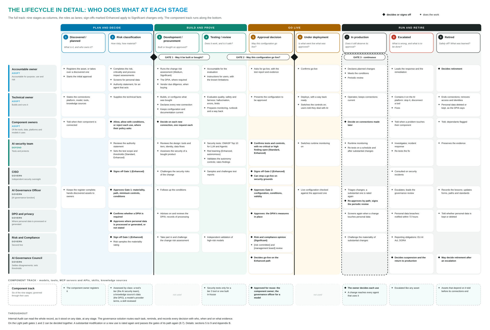

*Figure 7. The nine stages as columns and the roles as lanes: the specific actions of each role at each stage, the
decisions and sign-offs marked apart; the component track along the bottom. (Framework, Figure 7.)*

| Function | What the framework provides | What it requires |
|---|---|---|
| **Business owners and builders** | One point of entry; pre-filled forms; the go-live requirements known at Gate 1; visible status; decisions in days rather than weeks; approved components to build on | Registration before building; current owners and connections; planned changes declared; conditions met |
| **IT Director, Technology and Architecture** | Registration from pipelines and coding agents; a pipeline check whether a version is approved; platforms and components assessed once and reused; clear rules for connections and tool tiers | Participation in choosing the governance solution; read-only access for its connectors; directory integration; hosting; a means to stop each agent on each platform; integration with [CMDB / Jira] |
| **CISO and the AI security team** | A complete inventory, including unregistered agents; which agents can act, through which tools, tiers and identities; an authority statement for every agent that acts; change detected rather than reported; testing separate from building and from independent challenge | *AI security team:* the testing standard and test sets per platform; platform assessments; testing and red teaming; runtime monitoring; the AI incident playbook. *CISO:* approval of the testing standard; challenge by sampling; sign-off on the Enhanced path; review of the governance solution's security |
| **Risk** | One consistent classification for all AI; change materiality applied to AI as to any other change; risks accepted with an owner and an expiry date; a portfolio view | Ownership of the materiality method and of the definition of a substantial modification; challenge of the change risk assessment; the appetite for autonomy; membership of the Council |
| **Data Protection Officer** | Every asset that processes or generates personal data, or has not stated it, routed at Gate 1 with the screening pre-filled; DPIA and records linked to the asset; screening repeated on change | The screening questions and approval criteria; confirmation when a DPIA is required; review of DPIAs |
| **Compliance and Legal** | An EU AI Act class for every asset, with the answers behind it; prohibited practices identified at intake; requirements traced to controls and evidence | Validation of the risk assessment's logic and of the regulatory map; the organisation's EU AI Act role (provider or deployer) for agents built in-house |
| **Internal Audit** | An immutable record of who built, validated and approved what, when, on what evidence and under which workflow version, for any date | Agreement on the audit evidence expected; early review of the control design |

*Framework: sections 5, 7.2 and 10.*

---

## 7. Support for owners and builders

**In brief.** Governance is effective only when the governed route is quicker than circumventing it. The governance
solution reads, pre-fills, settles routine cases by rule, routes, reminds and records, so that people spend their
time on decisions, challenge and testing. Pipelines and coding agents use the same functions through an API. Automation
prepares decisions and never takes them.

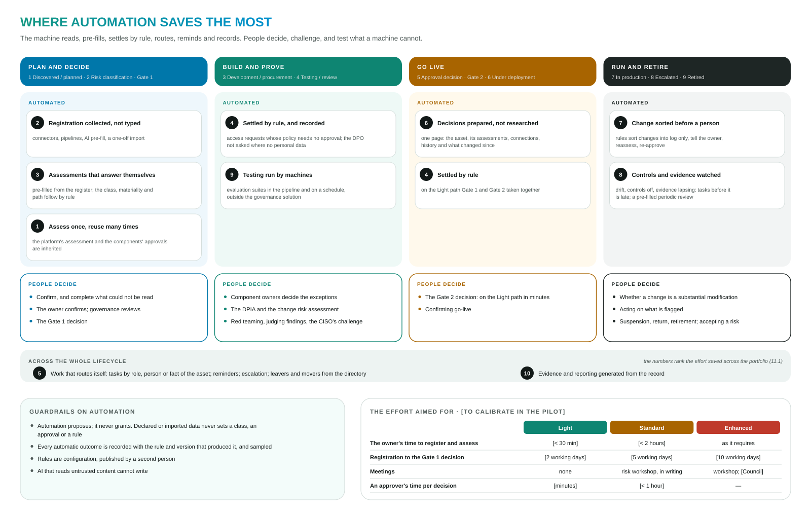

*Figure 8. The ten areas of automation on the four phases of the lifecycle; what remains with people; the guardrails;
the effort targets. (Framework, Figure 11.)*

| # | Area | What is automated |
|---|---|---|
| 1 | Assess once, reuse many times | Platforms and components are assessed once; agents built on them inherit the assessments and approvals |
| 2 | Registration collected | Connectors, pipelines and AI pre-filling replace typing; existing registers are imported once |
| 3 | Assessments that conclude | Forms ask only what applies and are pre-filled from the register; the risk class, materiality and path follow by rule |
| 4 | Settled by rule | Access requests that need no decision, Light-path gates combined, "log only" changes, each recorded as such |
| 5 | Work that routes itself | Tasks by role, person or fact of the asset; reminders and escalation; leavers' work reassigned from the directory |
| 6 | Prepared decisions | One page per approval with the asset, its evidence and what changed since the approver last looked |
| 7 | Change sorted by rule | Reported and detected changes triaged before they reach a person |
| 8 | Continuous control monitoring | Drift, controls switched off and evidence nearing expiry become tasks before they lapse |
| 9 | Testing by machine where possible | Evaluation suites in the build pipeline and on a schedule, their results linked to the asset |
| 10 | Evidence and reporting generated | Dossier, approval record, audit trail and reports produced from the record; each fact entered once |

**For pipelines and coding agents:** registration and updates through the API [and MCP] with a machine-readable
declaration, as part of the build; the questions "what would this change mean?" and "is this version approved?"
before deployment; test results delivered to the asset. They act under the same permissions as a person, on behalf of
an accountable person, and in the same record.

**What remains with people:** the decisions at the gates; whether a change is a substantial modification; red
teaming, judging findings and the CISO's challenge; the DPIA, the change risk assessment and the acceptance of risk.

*Framework: section 11.*

---

# Part II — The governance model

Part II sets out how the framework decides and controls. It is written for AI governance, Risk, Compliance and Legal,
the Data Protection Officer and Internal Audit, and for the CISO and the IT Director on the topics named in the
reading paths.

---

## 8. Operating model

**In brief.** The three pillars are separate functions, each with its own question, people and output. The separation
applies within security as well: the AI security team tests, and the CISO challenges independently. The AI Governance
Council is the body in which the three pillars meet. Roles are assigned through groups of the organisation's
directory; ownership follows from being named on an asset.

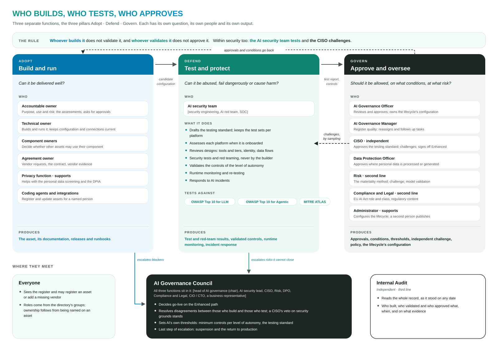

*Figure 9. The three pillars with their questions, roles and outputs; the rule that keeps them apart; the AI
Governance Council; the independent assurance of Internal Audit. (Framework, Figure 3.)*

| Pillar | Its question | Who | What it produces |
|---|---|---|---|
| **Adopt** · build and run | Can it be delivered well? | Accountable and technical owners, platform and engineering teams, procurement | The asset, its documentation, releases, runbooks |
| **Defend** · test and protect | Can it be abused, fail dangerously or cause harm? | The AI security team [security engineering, AI red team, SOC] | Security test and red-team results, validated controls, runtime monitoring, incident response |
| **Govern** · approve and oversee | Should it be allowed, on what conditions, at what risk? | AI Governance Officer and AI Governance Council; independently the CISO, DPO, Risk, Compliance and Legal | Approvals, conditions, thresholds, independent challenge, policy, the configuration of the lifecycle |

**The AI Governance Council.** [Composition: head of AI governance (chair), lead of the AI security team, CISO, Chief
Risk Officer or delegate, DPO, Compliance and Legal, CIO / CTO or delegate, a business representative.] The Council:

- decides go-live on the Enhanced path;
- resolves disagreements between those who build and those who test [without overruling a veto of the CISO on
  security grounds, where the information security policy provides one];
- sets the thresholds specific to AI: the minimum controls per level of autonomy and, once the CISO has approved it,
  the testing standard. The change materiality method comes from [the change risk management standard], to which
  the Council proposes changes;
- is the final level of escalation, and decides on suspending an asset and on its return to production.

**Further roles.** Beyond those of section 2: **Risk** (second line: risk appetite, the change materiality method, the
change risk assessment, model validation); **Compliance and Legal** (second line: EU AI Act role and class, prohibited
practices); **Internal Audit** (third line: independent assurance, with access to the whole record and any past date);
**[the privacy function]** (supports owners in the screening and the DPIA; keeps records of processing); the
**AI Governance Manager** (register quality, reassignment, overdue work); the **administrator** (configures classes,
forms and workflows, and cannot weaken safeguards unseen); **coding agents and integrations** (act within a granted
scope on behalf of an accountable person).

**The responsibility matrix**

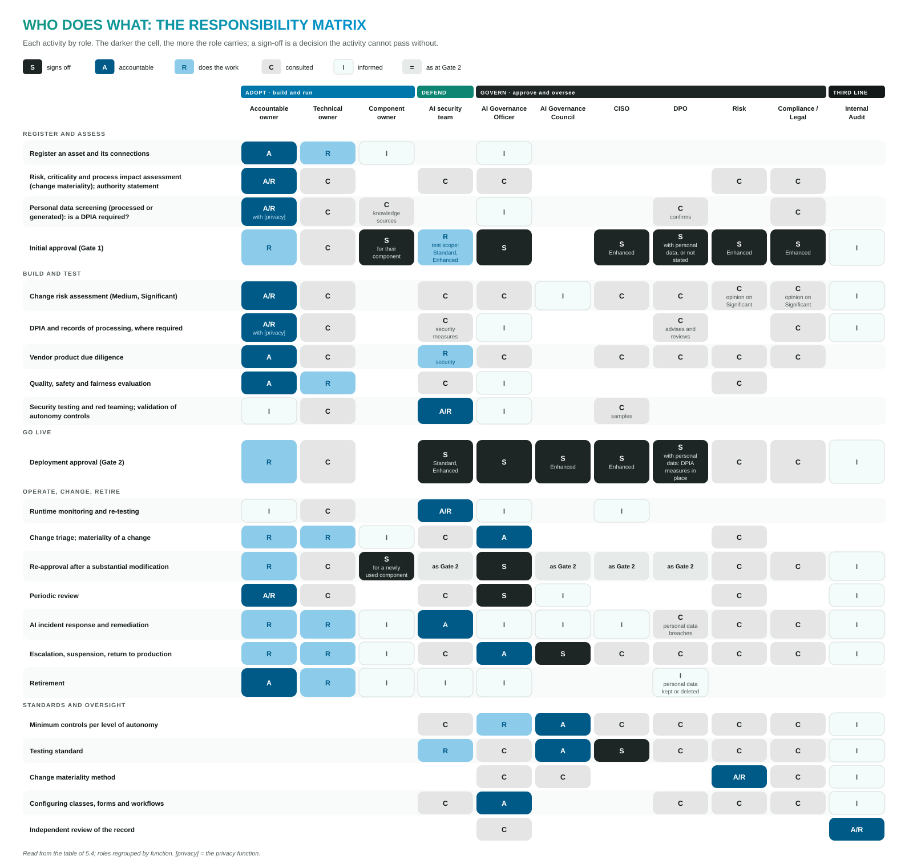

*Figure 10. Responsibilities by activity: twenty activities by role, the roles grouped by pillar. The darker the cell,
the greater the responsibility; S marks a sign-off. (Framework, Figure 4 and the table in 5.4.)*

**Separation of duties and effective oversight.** The approver is never the requester, and the validator is never the
builder. A second person publishes every change to workflows and forms. Approvers receive a prepared task with the
asset, its assessments, documentation, connections and history in one place. Approval rates and review times are
monitored, and unusual patterns, such as approvals given in seconds, are reviewed by sampling, so that volume does not
turn oversight into a formality.

*Framework: section 5.*

---

## 9. Proportionality: the method

**In brief.** Two independent dimensions set the level of governance. The **change materiality** determines the path:
the depth of the risk assessment, who takes part and who decides. The **level of autonomy** determines the minimum
controls, whatever the path. Every tool carries a **trust tier**. Any asset that processes or generates personal data
follows the **data protection route**. A component is not rated by materiality but assessed by its class.

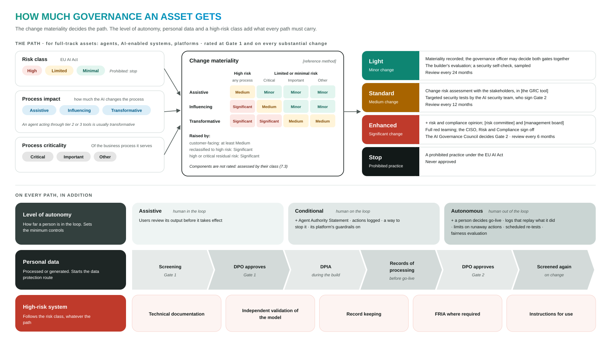

*Figure 11. For full-track assets the change materiality decides the path; components are assessed by their class. On
every path, the level of autonomy sets the minimum controls, personal data starts the data protection route, and a
high-risk system carries its own requirements. (Framework, Figure 5.)*

### 9.1 Change materiality

A change is a new asset, a new use of an approved asset, or a substantial modification of an asset in use. Its
materiality is rated at Gate 1 and again whenever the asset or its use changes substantially, as [the change risk
management standard] defines.

| Input | Question | Values |
|---|---|---|
| **Risk class** | How does the EU AI Act classify it? | High · limited · minimal. A prohibited practice stops the process |
| **Process impact** | How much does the AI change the business process? Test: if the AI stopped tomorrow, what would happen to the process? | **Assistive:** supports a person in an unchanged activity; the process would continue, only slower · **Influencing:** recommends, scores, prioritises or routes; people still decide, but the process has been adjusted to its output · **Transformative:** executes process steps, makes or effectively determines decisions, or replaces a control |
| **Process criticality** | How critical is the business process it serves? | Critical · important · other [as business continuity management rates them]; where several are affected, the most critical counts |

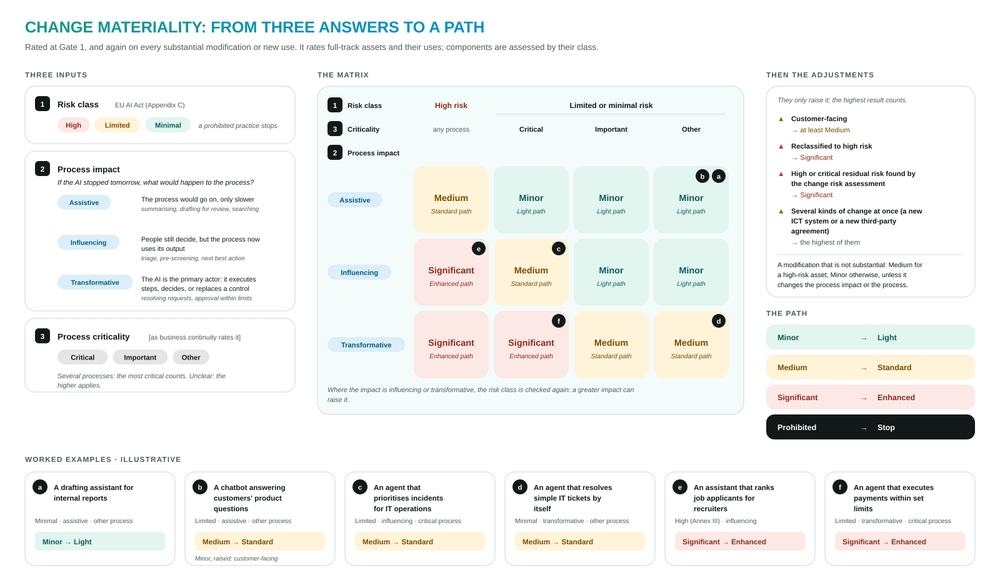

*Figure 12. The three inputs, the matrix of the reference method, the adjustments that can only raise the result, and
the path it sets. The examples are illustrative. (Framework, Figure 6.)*

| Process impact | High risk, any process | Limited or minimal risk, critical process | … important process | … other process |
|---|---|---|---|---|
| **Assistive** | Medium | Minor | Minor | Minor |
| **Influencing** | Significant | Medium | Minor | Minor |
| **Transformative** | Significant | Significant | Medium | Medium |

**Adjustments, which can only raise the result:** a customer-facing asset is at least Medium; reclassification to high
risk makes it Significant; a high or critical residual risk found in the change risk assessment makes it
Significant; where several kinds of change coincide (for example, with a new ICT system or third-party agreement), the
highest materiality applies. The organisation's change risk management standard prevails where it differs.

**Rules.** The owner rates the materiality; governance reviews it at Gate 1. Anyone may raise the path; lowering it
below the method's result requires a recorded reason [approved by the owner of the change risk standard]. Neither
personal data nor the level of autonomy changes the path: each has its own requirements on every path. The
requirements for a high-risk system follow its risk class, whatever its path. The values are starting points,
calibrated in the pilot and held as configuration.

### 9.2 The paths in full

| | **Light** · minor | **Standard** · medium | **Enhanced** · significant | **Stop** · prohibited |
|---|---|---|---|---|
| **Change risk assessment** | Rating recorded; risks handled in normal operations | Documented with the relevant stakeholders [risk workshop], recorded in [the GRC tool]; Risk and Compliance invited; stakeholders sign off, recording any disagreement | As Standard, with Risk and Compliance taking part; a written risk and compliance opinion; review by [the risk committee] and [the management board] before go-live | — |
| **Initial approval (Gate 1)** | AI Governance Officer; component owners; DPO where personal data | + the AI security team sets the test scope | + CISO, Risk, Compliance and Legal | Not approved |
| **Testing** | The builder's documented evaluation; a security self-check, sampled | + targeted security tests by the AI security team | + full red teaming; re-tests on a schedule | — |
| **Other evidence** | Owner's attestation; a DPIA where required | + the design of human oversight | + operational resilience measures where a critical process depends on it | — |
| **Deployment approval (Gate 2)** | AI Governance Officer [+ DPO]; may be combined with Gate 1 | + the AI security team | AI Governance Council, with the CISO's sign-off; [the management board] where the change risk standard requires | — |
| **Periodic review** | Every 24 months | Every 12 months | Every 6 months | — |

### 9.3 Minimum controls per level of autonomy

| | **Assistive** (human in the loop) | **Conditional** (human on the loop) | **Autonomous** (human out of the loop) |
|---|---|---|---|
| **Meaning** | A person reviews and confirms its output before it takes effect | It acts within approved limits; a person monitors and can intervene | It pursues multi-step goals with limited or delayed human review |
| **Minimum controls** | The owner's assessments; users review its output | + Agent Authority Statement · actions logged · a way to stop it · the platform's guardrails on | + go-live decided by a human approver · logs that can replay prompts, context and tool calls · limits that stop runaway actions · re-testing on a schedule · a fairness evaluation where it affects people |

The level of autonomy concerns how far a person is in the loop; the process impact concerns the business process.
The two are rated separately. Where a platform cannot yet provide a control, the approval records the gap as a
condition with an owner and a date.

### 9.4 Trust tiers of tools and MCP servers

| Tier | Reach | Example | Approval and testing |
|---|---|---|---|
| **1 · Read** | Reads information inside the organisation; changes nothing | Searching the policy library | Approved for reuse by its owner; a check |
| **2 · Write inside** | Changes data or starts processes inside the organisation | Updating a CRM record; opening a ticket | + its owner approves each agent that uses it; a review |
| **3 · Act outside** | Sends to people or systems outside, moves money, or acts irreversibly | Sending an e-mail to a customer; making a payment | + its owner approves each agent that uses it; security tests |

The tier is stated at registration and confirmed by the AI security team. An agent acting through a tier 2 or 3 tool
usually executes process steps itself, which makes its process impact transformative. Instructions returned by a tool
are never treated as instructions.

### 9.5 The data protection route

The route applies on every path whenever an asset **processes personal data or may generate it**, for example a
summary of a customer's complaint or an inference about a person's income or health. An unanswered question counts
as yes.

| Step | When | What | Who |
|---|---|---|---|
| 1 Screening | Gate 1 | Personal data read or generated; special categories; decisions about people (GDPR Art. 22); where the data goes and how long it is kept; whether a DPIA is required (Art. 35) | Accountable owner with [privacy]; the DPO confirms |
| 2 DPO approval | Gate 1 | Approval, usually with conditions such as "DPIA before go-live" | DPO |
| 3 DPIA | Before Gate 2 | Lawful basis, necessity, minimisation, risks to people, vendor terms, retention, data subject rights | Accountable owner with [privacy]; the DPO reviews |
| 4 Records | Before go-live | The record of processing (Art. 30) created and linked to the asset | [Privacy] |
| 5 DPO approval | Gate 2 | The DPIA's measures are in place | DPO |
| 6 Repeat | On a change that touches personal data | The screening again; the DPIA reviewed | Accountable owner; DPO |

*Framework: section 6.*

---

## 10. Testing standard

**In brief.** Testing shows, before go-live and after change, that an asset works as intended, cannot easily be abused
and does not cause harm. It covers four classes of harm, at a depth set by the path and the level of autonomy. Security
is tested by the AI security team, never by the builder. A platform is assessed once when it is onboarded, and agents
built on it inherit that assessment.

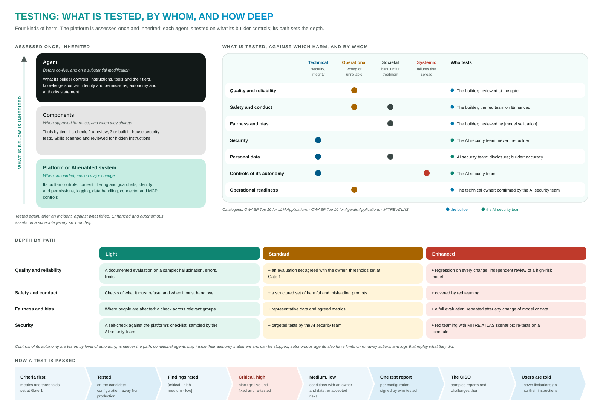

*Figure 13. What is assessed once and inherited, what is tested against which class of harm and by whom, the depth
per path, and how a test is passed. (Framework, Figure 9.)*

**Classes of harm**

| Class of harm | What can go wrong |
|---|---|
| **Technical** | Prompt injection and jailbreaks; data leaking through answers or tools; tools misused; privileges abused through the agent's identity; poisoned knowledge or memory |
| **Operational** | Wrong or invented answers; errors that reach customers or decisions; runaway actions or cost; failure without a way back |
| **Societal** | Unfair treatment of groups of people; misleading or harmful content |
| **Systemic** | Failures that spread between agents or through a shared component |

**Depth of testing by path**

| Kind of testing | Light | Standard | Enhanced | Tested by |
|---|---|---|---|---|
| **Quality and reliability** | Documented evaluation on representative cases: hallucination, errors, limits | + an agreed evaluation set; thresholds set at Gate 1 | + regression on every change; independent review of a high-risk model | The builder |
| **Safety and conduct** | Checks of refusals and hand-over | + a structured set of harmful and misleading prompts | + red teaming | The builder; the red team |
| **Fairness and bias** | Where people are affected, a check across groups | + representative data and agreed metrics | + full evaluation, repeated on change | The builder, reviewed by [model validation] |
| **Security** | Self-check against OWASP LLM and Agentic, sampled | + targeted tests | + red teaming (MITRE ATLAS); scheduled re-tests | The AI security team |

On every path, in addition: **personal data** (disclosure only to those entitled, retention as set, accuracy about real
people); **controls of autonomy** by level (the authority statement holds, the stop works, limits halt runaway actions,
the logs replay what it did); **operational readiness** (monitoring, guardrails, fallback and a way back).

**What is assessed, and when**

| What is assessed | When |
|---|---|
| A platform or AI-enabled system | When it is onboarded, and on major change: its built-in controls, inherited by the agents built on it |
| A tool, MCP server or API | When approved for reuse, and when its tier or capabilities change |
| A skill | When approved for reuse, and on a new version |
| An agent | Before go-live, and on a substantial modification: what its builder controls |
| Any asset after an incident | Before it returns to production |
| Enhanced assets and autonomous agents | On a schedule [every six months] |

**How a test is passed.** Criteria are set at Gate 1, before results are known. Findings are rated [critical · high ·
medium · low]; critical and high findings block go-live until fixed and re-tested; the others become conditions or
accepted risks with an owner and a date. One signed test report per candidate configuration states the configuration
tested, the scope, the results by harm, the findings and the known limitations, which are passed on to users. The CISO
samples reports and challenges them. The AI security team drafts the standard, the CISO approves it, and the Council
adopts it; it is reviewed every year.

*Framework: section 8.4 and Appendix D.*

---

## 11. Monitoring, incidents and evidence

**In brief.** Two kinds of monitoring apply in production. Runtime monitoring of behaviour is a control run by the AI
security team and the platform teams with their own tools. The governance solution monitors whether governance still
holds. AI incidents follow the existing incident process with defined AI extensions, and the evidence retained allows
an agent's actions to be reconstructed.

**Governance monitoring**

| Governance monitoring | Question |
|---|---|
| Control health | Are the required controls still on: logging, guardrails, access scope? |
| Configuration drift | Does what runs still match what was approved? |
| Use against purpose | Who uses it, where and how much, against what was approved? |
| Evidence validity | Are assessments, tests and attestations still valid? |
| Dependency health | Model deprecations, vendor changes, vulnerabilities in components |
| Oversight quality | Approval rates, review times, overrides |
| Coverage | Which assets are not monitored, and when each was last verified |

**AI incidents**

| Incident element | Requirement | Owner |
|---|---|---|
| **Categories** | Harmful or wrong output with impact; data leaked through an agent; an agent acting beyond its authority; manipulation such as prompt injection; misuse; an incident at an AI vendor | AI security team with [Operational Risk] |
| **Playbook** | Contain, capture evidence, notify, report (section 5) | AI security team |
| **Reporting** | EU AI Act Art. 73 (with Art. 26 for deployers); DORA Arts. 17–19; GDPR Art. 33, through the existing processes | [Operational Risk], Compliance, DPO |
| **Evidence** | For conditional and autonomous agents, logs of prompts, retrieved context and tool calls, kept long enough to replay what happened [at least six months for high-risk systems, EU AI Act Art. 26(6)] | Technical owner; AI security team |
| **Exercise** | At least one tabletop exercise per year on an AI incident scenario | AI security team |
| **Lessons** | Fed back into the forms, the paths, the testing standard and the policy | AI Governance Officer |

The governance solution links an incident to the asset, so that the question "which agents use this model, tool or
knowledge source, and what was approved for them" is answered in minutes.

*Framework: sections 8.7 and 9.*

---

## 12. Principles, safeguards and guardrails

**In brief.** Thirteen principles govern the design of the framework. Four are guaranteed as safeguards that no
configuration can remove. Three protections are active by default; they can be switched off only with a recorded
reason, and remain visible for as long as they are off. Automation is bound by its own guardrails.

**The thirteen principles**

| # | Principle | In practice |
|---|---|---|
| 1 | **Outcome-producing assets are the centre** | Governance attaches to the agents and systems that deliver outcomes; components are governed so that they can be reused safely |
| 2 | **One register, one record** | Every asset has one entry and one permanent code; facts are captured once |
| 3 | **Collected, not submitted** | What a connector can read is not typed; what can be pre-filled is pre-filled, and people confirm |
| 4 | **Declared is verified, never trusted** | Declarations are kept apart from discoveries; where they differ, the discovery prevails and the gap is raised |
| 5 | **Build, test and approve are separate** | No single function builds, validates and approves the same asset |
| 6 | **Proportionate** | The depth of the risk process follows the change materiality; the controls follow the level of autonomy |
| 7 | **AI assists, people decide** | AI may draft a registration or suggest answers; a person confirms |
| 8 | **Nothing is rewritten** | Every change is recorded with who, when and why; the record can be shown as it was on any past date |
| 9 | **Configurable, visibly** | Classes, fields, stages, forms and workflows are configuration, versioned and published by a second person |
| 10 | **The product is governed, not the vendor** | Assessment and approval attach to a vendor's product at a version |
| 11 | **Detect rather than block** | The governance solution stays out of the live path; it compares what runs with what was approved, and escalates gaps |
| 12 | **Agents are users too** | What a person can do on the screens, a pipeline or coding agent can do through an API [and MCP], under the same permissions |
| 13 | **Data stays under the organisation's control** | Governance data is held where the organisation controls it; sign-in is through its own identity provider |

**Safeguards and protections**

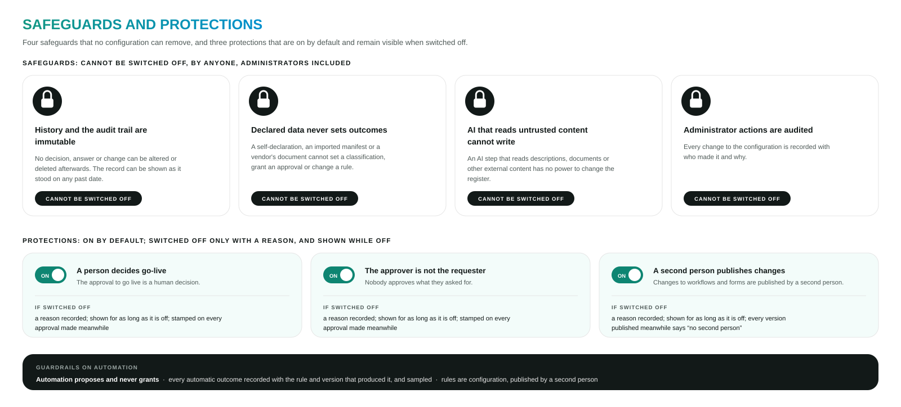

*Figure 14. The four safeguards that no configuration can remove, the three protections that are on by default and visible when off, and the guardrails on automation.*

| Safeguard that no configuration can remove | What it guarantees |
|---|---|
| **History and the audit trail are immutable** | No decision, answer or change can be altered or deleted afterwards, by anyone, administrators included |
| **Declared data never sets outcomes** | A self-declaration, an imported manifest or a vendor's document cannot set a classification, grant an approval or change a rule |
| **AI that reads untrusted content cannot write** | An AI step that reads descriptions, documents or other external content has no power to change the register |
| **Administrator actions are audited** | Every configuration change is recorded with who made it and why |

| Protection, on by default | If switched off |
|---|---|
| A human decision in the approval to go live | Permitted with a reason; shown for as long as it is off, and stamped on every approval made meanwhile |
| The approver is not the requester | As above |
| A second person publishes changes to workflows and forms | As above; every version published meanwhile is marked "no second person" |

**Guardrails on automation.** Automation proposes and never grants: declared or imported data never sets a
classification, an approval or a rule on its own. Every automatic outcome is recorded with the rule and version that
produced it, and governance samples such outcomes as it samples approvals. Rules are configuration, published by a
second person.

*Framework: sections 4 and 11.3.*

---

## 13. Supporting technology, security and privacy

**In brief.** The framework is operated with a **governance solution** that holds the register, runs the workflows and
assessments, and keeps the record. It stays out of the live path between people and AI, links to the existing tools
rather than replacing them, and keeps governance data under the organisation's control. Because it knows every AI
asset and its weaknesses, it is itself subject to strict security and privacy requirements. The framework is agreed
first; the solution is selected against it.

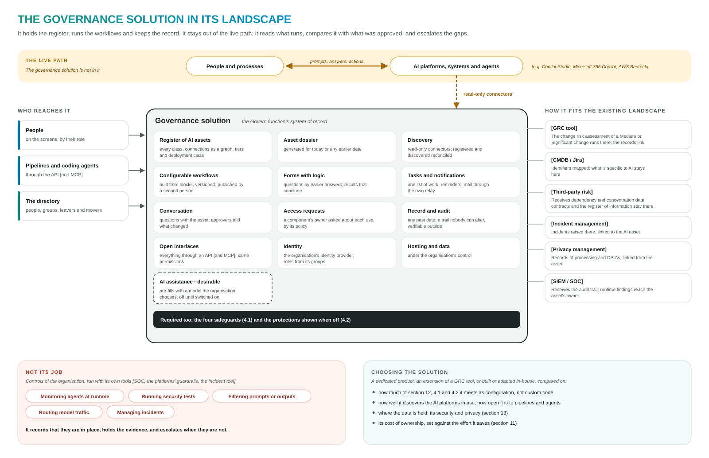

*Figure 15. What the solution must do, who reaches it, how it links to the existing tools, and what is not its job.
(Framework, Figure 12.)*

**What the governance solution must do**

| Capability | Requirement |
|---|---|
| Register of AI assets | One register for every class, with connections as a graph, trust tiers and deployment classes |
| Asset dossier | Generated from the register, for today or any earlier date |
| Discovery | Read-only connectors to the AI platforms in use; registered and discovered reconciled; scheduled audits |
| Configurable workflows and forms | Built from building blocks without code; versioned; published by a second person; forms with logic that conclude |
| Tasks, notifications, conversation | One work list per person; reminders; questions kept with the asset |
| Access requests | The owner of a component asked about each use, by its policy; requests that need no decision settled by rule |
| Record and audit | The record as it stood on any date; an audit trail that nobody can alter and that can be verified independently |
| Open interfaces | Everything available through an API [and MCP] under the same permissions, including "is this version approved?" |
| Identity, hosting and data | Sign-in through the organisation's identity provider; roles from directory groups; data under the organisation's control |
| AI assistance (desirable) | Pre-filling with a model the organisation chooses; off unless switched on |

**Not its task:** runtime monitoring of agents, security testing, prompt or output filtering, routing of model traffic,
incident management. These are controls of the organisation, run with its own tools; the governance solution records
that they are in place, holds the evidence and escalates when they are not.

**Integration:** the change risk assessment of a Medium or Significant change runs in [the GRC tool], linked to the
asset; identifiers are mapped to [the CMDB]; dependency data is supplied to [third-party risk]; incidents remain in
[incident management]; DPIAs and records of processing are linked from [privacy management]; the audit trail is
supplied to [the SIEM].

**Selection.** The options are a dedicated AI governance product, an extension of an existing GRC tool, or a solution
built or adapted in-house. They are compared on how much of the requirements they meet by configuration rather than
custom code, discovery of the AI platforms in use, openness to pipelines and coding agents, where the data is held,
security and privacy, and cost of ownership against the effort saved.

**AI-specific risks**

| AI-specific risk | How the lifecycle addresses it |
|---|---|
| **Shadow AI:** agents nobody registered | Discovery and reconciliation; detection latency measured |
| **Excessive agency:** tools that write, send or act beyond purpose | Minimum controls and the authority statement; trust tiers; component owners' consent; triage when a higher-tier tool is added |
| **Prompt injection, goal hijacking, tool misuse, memory poisoning** | Security tests and red teaming; runtime monitoring; in the governance solution, AI that reads untrusted content cannot write |
| **Data leakage through tools and knowledge sources** | Knowledge sources registered with their data classes; the data protection route; access requests to data owners |
| **Over-privileged agent identities** | Design review and security testing; identities removed at retirement |
| **Supply chain:** platforms, MCP servers, skills, models, vendor products | Platforms assessed at onboarding; components tiered and assessed once; skill files scanned; vendor watch; change propagated to dependants |
| **Drift after approval** | Approval bound to a configuration; drift detected; substantial modification re-approved |
| **Oversight becoming a formality** | Oversight quality monitored |

**Security of the governance solution:** data under the organisation's control; sign-in through its identity provider
with multi-factor authentication; read-only connectors with their own credentials and explicit permissions; secrets
protected with a key the organisation controls; uploaded files scanned; content read from AI platforms treated as
untrusted data; an append-only, tamper-evident audit trail that can be verified externally; AI assistance off until
enabled; a maintained threat model and an independent penetration test before production use.

**Privacy of the governance solution:** it holds little personal data (names, e-mail addresses and sign-in names from
the directory, and what people write about assets); the audit trail records pseudonymous identifiers; e-mails carry
the asset's code and name, what is asked, by when, and a link, never answers or comments; its own AI features are
governed like any other AI asset; erasure requests are met without breaking the immutable record [to be settled with
the DPO].

*Framework: sections 12 and 13.*

---

## 14. Regulatory alignment

**In brief.** The lifecycle produces the evidence that the applicable regulations and standards require as part of
its normal operation. The mapping is indicative, to be validated by Compliance and Legal; no tool makes an
organisation compliant on its own.

| Source | Requirement | Where the framework addresses it |
|---|---|---|
| **EU AI Act** | Art. 4 AI literacy · Art. 5 prohibited practices · Art. 6 and Annex III high-risk classification · Arts. 14 and 26 human oversight and deployer obligations · Art. 27 FRIA · Art. 50 transparency · Art. 73 serious incidents | Roles and roadmap · the risk assessment at Gate 1 and the Stop path · minimum controls per level of autonomy · testing, rollout, monitoring and evidence retention · incidents |
| **GDPR** | Art. 22 automated decisions · Art. 25 data protection by design · Art. 28 processors · Art. 30 records of processing · Art. 33 breach notification · Art. 35 DPIA | The data protection route; personal data testing; incidents |
| **DORA** | Art. 8 inventory of ICT assets and dependencies · Arts. 17–19 ICT incidents · Art. 28 ICT third-party risk and the register of information | Register and connections; incidents; vendor due diligence and shared responsibility |
| **ISO/IEC 42001** | AI risk and impact assessment; AI system life cycle; third-party relationships | Assessments; the lifecycle; vendor due diligence |
| **NIST AI RMF** | Govern · Map · Measure · Manage | Operating model and configuration · register and assessments · testing and monitoring · gates, change, escalation and incidents |

*Framework: Appendix E.*

---

## 15. Implementation roadmap

**In brief.** The framework is agreed first; the technology that supports it is selected against it afterwards. Six
phases lead from agreement to the full lifecycle, and ten measures show whether the model works.

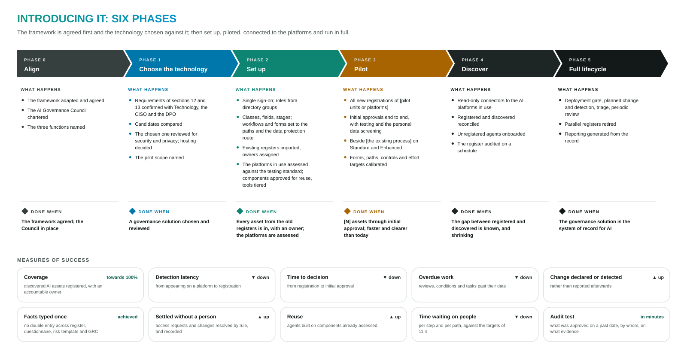

*Figure 16. The six phases with their activities and completion criteria, and the measures of success. (Framework,
Figure 13.)*

**The six phases**

| Phase | Main activities | Complete when |
|---|---|---|
| **0 · Align** | The framework discussed and agreed; the AI Governance Council chartered; the three pillars staffed | The framework is agreed and the Council is in place |
| **1 · Choose the technology** | Requirements confirmed with Technology, the CISO and the DPO; candidates compared; the chosen solution reviewed for security and privacy; hosting decided; pilot scope named | A governance solution is chosen and reviewed |
| **2 · Set up** | Single sign-on and roles; classes, workflows and forms set to the paths and the data protection route; existing registers imported; the AI platforms in use assessed against the testing standard; components approved and tools tiered | Every asset from the existing registers is recorded with an accountable owner; the platforms are assessed |
| **3 · Pilot** | All new registrations of [pilot units or platforms]; initial approvals end to end; run beside [the existing process] on Standard and Enhanced; paths, controls and targets calibrated | [N] assets through initial approval; faster and clearer than the current process |
| **4 · Discover** | Read-only connectors to the AI platforms; registered and discovered reconciled; unregistered agents onboarded | The gap between registered and discovered assets is known and decreasing |
| **5 · Full lifecycle** | Deployment gate, change detection, triage and periodic review; parallel registers retired; reporting generated from the record | The governance solution is the system of record for AI |

**Measures of success**

| Measure | Target direction |
|---|---|
| Coverage: discovered AI assets registered with an accountable owner | Towards 100% |
| Detection latency: from an agent appearing on a platform to its registration | Decreasing |
| Time to decision: from registration to initial approval | Decreasing |
| Overdue work: reviews, conditions and tasks past their date | Decreasing |
| Change declared or detected rather than reported afterwards | Increasing |
| Facts entered once, without duplication across register, questionnaire, risk template and GRC | Achieved |
| Access requests and changes settled by rule, and recorded | Increasing |
| Agents built on components already assessed | Increasing |
| Time waiting on people, per step and per path | Decreasing |
| Audit test: what was approved on a chosen past date, by whom, on what evidence | Answered in minutes |

**Prerequisites:** agreement on the framework; named people for the roles and the Council; once the technology is
chosen, read-only access to the AI platforms, directory integration, a hosting environment and the pilot scope.

*Framework: the implementation roadmap.*

---

## 16. Adoption of the framework

An organisation adopting the framework typically proceeds as follows:

1. **Adapt** the framework: replace the placeholders in square brackets with the organisation's own committees,
   functions and tools, and align the change materiality with its change risk management standard.
2. **Establish** the AI Governance Council and staff the three pillars.
3. **Settle** the points that shape the choice of technology: integration with the existing GRC, CMDB, third-party
   risk and incident tools, and the retention of governance records.
4. **Select** the supporting technology against the requirements of section 13.
5. **Pilot** the lifecycle on real assets, and calibrate the paths, controls and effort targets.
6. **Connect** the AI platforms in use, and operate the full lifecycle.

---

## Abbreviations

| Abbreviation | Meaning |
|---|---|
| CISO | Chief Information Security Officer |
| CMDB | Configuration management database |
| DORA | Digital Operational Resilience Act (Regulation (EU) 2022/2554) |
| DPIA | Data protection impact assessment (GDPR Art. 35) |
| DPO | Data Protection Officer |
| FRIA | Fundamental rights impact assessment (EU AI Act Art. 27) |
| GRC | Governance, risk and compliance |
| MCP | Model Context Protocol: the open protocol through which AI agents call tools and data sources |
| RAG | Retrieval-augmented generation |
| SIEM / SOC | Security information and event management / security operations centre |

## Licence

© 2026 Andres Gavriljuk. Licensed under the
[Creative Commons Attribution-NonCommercial 4.0 International licence](https://creativecommons.org/licenses/by-nc/4.0/)
(CC BY-NC 4.0). It may be shared and adapted for non-commercial purposes, with attribution. For commercial use, ask the
author.

Attribution: *Andres Gavriljuk, "Agentic AI Implementation and Lifecycle Governance: Executive overview", version 1.0,
2026, https://github.com/pragmatiqai/governanceframework, CC BY-NC 4.0.*

OWASP, MITRE ATLAS and the other frameworks and products named belong to their owners. They are referred to, not
reproduced.
