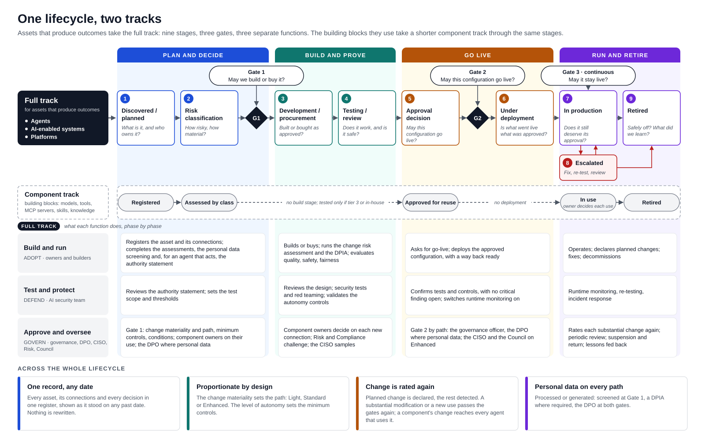
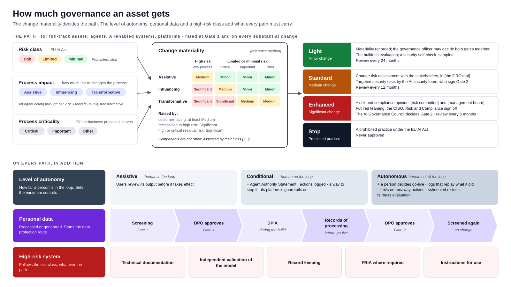
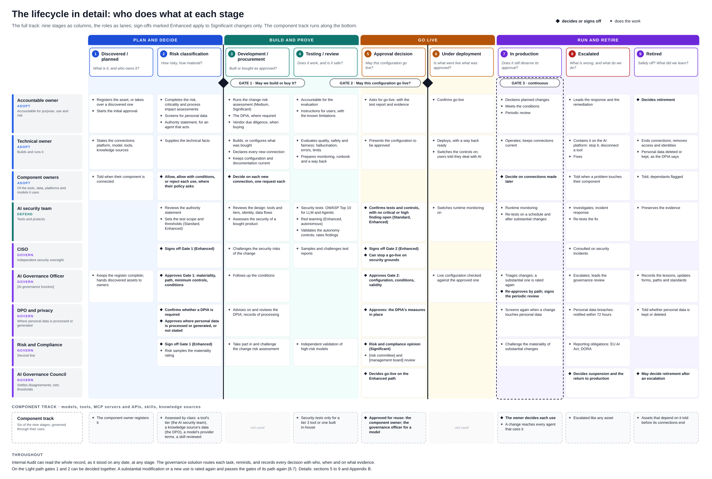

# Agentic AI Implementation and Lifecycle Governance

**One lifecycle for AI agents and the assets they are built from, from idea to retirement**

| | |
|---|---|
| Document | Governance framework for agentic AI |
| Version | 1.0 · September 2026 |
| Author | Andres Gavriljuk |
| Intended readers | CISO and information security · Risk (operational and model risk) · Data Protection Officer · Compliance and Legal · Technology and architecture · Internal Audit · business owners and builders of AI |
| How to use it | A template to adapt. Once an organisation has adapted and agreed it, it becomes the basis for [its AI standard] and for the requirements on the technology that supports it (section 12) |
| Licence | [Creative Commons Attribution-NonCommercial 4.0 International](https://creativecommons.org/licenses/by-nc/4.0/) (CC BY-NC 4.0) |

**Reading guide.** **Three figures introduce the whole model**, for readers who want the picture before the detail:
Figure 1, one lifecycle with its two tracks (section 1); Figure 2, how much governance an asset gets (section 6);
Figure 3, who does what at each stage (section 7). Section 1 is the summary on one page. Sections 2 to 4 say why and on
which principles. Section 5 says who builds, who tests and who approves; section 6 how much governance an asset gets.
Sections 7 to 9 are the core: the lifecycle, what happens at each stage, and what happens when something goes wrong.
Section 10 says what each function gets, section 11 how automation keeps all this fast and affordable, section 12 what
the technology that supports it must do, section 13 security and privacy, and section 14 how to start. Words in
[square brackets] are placeholders for the organisation's own names of committees, functions and tools.

---

## 1. Summary

AI has moved from a few projects a year to agents built every week, by many people, on many platforms. Agents do
more than answer: they call tools, read and write data, and start processes on our behalf. They are assembled from
shared parts (a platform, a model, connectors, skills, knowledge sources), and those parts change, often without the
agent's owner noticing.

Governance designed for occasional AI projects cannot keep up. Registers kept by hand go stale. The same facts are
typed into a questionnaire, a register, a risk template and a GRC tool. The answers that decide the most effort are
self-declared. And an approval is a point in time: once it is given, nobody sees that the instructions, the model or
the tools have changed.

This document proposes **one lifecycle for every AI asset**, with clear decisions, owners and evidence, in proportion
to risk. It follows the ADG framework (Adopt · Defend · Govern) of EC-Council and is meant to be run with **automated technology**
rather than documents and e-mails: one register of AI assets and their connections, workflows that governance
configures, assessments that pre-fill and conclude, and a record of every decision that cannot be rewritten. The
framework does not assume a particular product; section 12 sets what the technology must do.

*Figure 1. One lifecycle, two tracks. The full track, for assets that produce outcomes (agents, AI-enabled systems,
platforms): nine stages in four phases, three gates, and what each of the three functions does in each phase. The
shorter component track, for the building blocks they use. Across both, what runs through the whole lifecycle.*

**Eight key messages**

1. **Govern what produces outcomes.** Agents, AI systems and platforms deliver the business outcomes, so they are at
   the centre and take the full lifecycle. Models, tools, skills and knowledge sources are their building blocks and
   take a shorter component track: assessed once, reused many times, and governed through their uses.
2. **One record per asset.** Every asset has one dossier: purpose, owners, components,
   assessments, approvals, conditions and history, which can be shown as it stood on any date.
3. **One lifecycle, three decisions.** *May we build or buy it?* (initial approval) · *May this configuration go
   live?* (deployment approval) · *May it stay live?* (change, monitoring and periodic review).
4. **Build, test and approve are separate.** Whoever builds an asset does not validate it, and neither approves it.
   Security is tested by an AI security team and challenged independently by the CISO. An AI Governance Council
   decides where building and security disagree.
5. **Effort in proportion to risk.** The **change materiality** decides the path (light, standard or enhanced): the
   EU AI Act risk class, how much the AI changes the business process, and how critical that process is. It is
   rated when an asset is first assessed and again whenever it changes substantially. The more an agent may do on
   its own, the more controls it needs, whatever its path.
6. **Collected, not submitted.** What an AI platform can tell us is read from it, not typed. What people declare is
   checked against what is discovered. Components are assessed once and reused, and routine outcomes are settled by
   rule. People spend their time where judgement is needed; AI helps prepare decisions, and people take them
   (section 11).
7. **Nothing is rewritten.** Every fact, decision and change is recorded with who, when and on what evidence, and
   can be reconstructed later.
8. **Configurable, visibly.** Governance configures classes, forms and workflows without code. Four safeguards
   cannot be switched off by anyone; switching off a default protection is always recorded and shown.

**How to adopt it:** replace the placeholders with the organisation's own names; agree the principles, the operating
model and the lifecycle (sections 4 to 9) with the functions they involve; name people for the roles and the Council
(section 5); and calibrate the paths and targets in a pilot (section 14).

---

## 2. Why agentic AI needs its own lifecycle

| What is different about agents | What it means for governance |
|---|---|
| **They act.** Agents call tools that write, send, pay or trigger processes, sometimes with no person in between | Autonomy and what the tools can do matter as much as the model. The level of autonomy and the trust tier of every tool are core facts about every agent |
| **They are assembled.** An agent is a platform, a model, tools and connectors (MCP servers, APIs), skills, knowledge sources and an identity | Governance must see the dependencies. A change to a shared component is a risk to every agent built on it, and a component's owner has a say in who uses it |
| **Many people build them, quickly.** Business users on low-code platforms, engineers with coding agents | Registration has to take minutes and should mostly happen by itself. The front door must be easier than going around it |
| **They keep changing.** Instructions, tools and knowledge are edited after approval; vendors ship new model versions | An approval binds to a specific configuration. Planned change is declared; the rest is detected, not left to the owner to report |
| **They run on vendor products that change on the vendor's schedule** | We govern the vendor's *product and version*, not the vendor; we know which controls are ours and which the vendor's, watch the product for change and always make our own assessment |
| **They can be attacked in new ways.** Prompt injection, tool misuse, poisoned knowledge, hijacked goals | Security testing against the established AI threat catalogues, before go-live and again when things change |
| **Regulation applies.** EU AI Act, GDPR, DORA and sector supervision | For any asset and any date we must be able to show what applied, what was decided, by whom and on what evidence |

**Where most organisations start.** AI registers in several spreadsheets or lists that duplicate the CMDB; a
classification questionnaire with self-declared answers; a separate risk template; larger changes in a GRC tool;
approvals in e-mails and minutes; and no view of which agents actually run on the platforms. [Replace with the
organisation's current state.]

---

## 3. Scope and key terms

### 3.1 What is in scope

Every AI asset the organisation builds, buys or uses in its business: built in-house, bought as a product, or part
of a product we use. The register knows eight classes of asset:

| Class | What it is | Examples |
|---|---|---|
| **Agent** | A custom agent or AI workflow built by or for us, usually on a platform | A Copilot Studio agent that answers HR questions; a Bedrock agent that reads incoming documents |
| **AI-enabled system** | A software product with AI capabilities, or a ready-made agentic system | A CRM with built-in AI features; GitHub Copilot |
| **Platform** | A general-purpose AI platform that people use directly or build agents on | Microsoft 365 Copilot and Copilot Studio; ChatGPT Enterprise; AWS Bedrock |
| **Model** | A foundation, fine-tuned or classical machine-learning model | A version of a large language model; an in-house scoring model |
| **Tool or connector** | Something an agent can call: an MCP server, an API, a connector | A CRM connector; an action that sends e-mail |
| **Skill** | A reusable package of instructions or capability shared between agents | A "summarise a credit memo" skill |
| **Use case** | The business purpose an agent or system serves | First-line triage of customer requests |
| **Knowledge source** | What an AI reads to answer: document stores, retrieval (RAG) indexes, databases | An index of internal policies |

The organisation can add classes and fields of its own, and switch off preconfigured fields and stages it does not
need (Appendix A).

**Out of scope [to confirm]:** an employee's personal-productivity use of an approved general-purpose tool
(for example asking Copilot to draft an e-mail) is governed by the [acceptable-use policy], not asset by asset; the
tool itself is registered and governed. Software without AI is out of scope.

### 3.2 Key terms

| Term | Meaning |
|---|---|
| **Accountable owner** | The business person accountable for the asset's purpose, use and risks. Completes the assessments and asks for approvals |
| **Technical owner** | The person who builds or runs the asset and keeps its configuration and documentation current |
| **Connection** | A typed dependency between assets: an agent *built on* a platform, *using* a model, *calling* a tool, *reading* a knowledge source. *Discovered* by a connector or *declared* by a person; the two are kept apart |
| **Lifecycle stage** | Where an asset stands, from *Discovered / planned* to *Retired* (section 7) |
| **Track** | The path an asset takes through the lifecycle, decided by its class. The *full track*, all nine stages and three gates, is for the assets that produce outcomes: agents, AI-enabled systems, platforms. The *component track*, six stages, is for the building blocks they use: models, tools, skills, knowledge sources (7.1) |
| **Workflow** | A configured sequence of steps that runs on an asset, for example the initial approval. It has versions; each run keeps the version it started on |
| **Assessment** | A form answered by the owner (risk, criticality and process impact, and others). The answers are kept as a record and can set fields of the asset |
| **Approval** | A decision by a named person, with or without conditions, on the asset as it stood when decided |
| **Access request** | A request to the owner of a component (a tool, a knowledge source, a platform) to allow its use by an agent or system |
| **Risk class** | The EU AI Act class: Prohibited, High, Limited (transparency obligations) or Minimal |
| **Process criticality** | How critical the business process the asset serves is: *critical*, *important* or *other*, as [business continuity management] rates it |
| **Process impact** | How much the AI changes that process: *assistive* (supports a person in an unchanged activity), *influencing* (shapes decisions that people still take), *transformative* (does the work or effectively decides) (6.2) |
| **Change materiality** | *Minor*, *medium* or *significant*, from the risk class, the process impact and the process criticality, as [the change risk management standard] sets it. It decides the path (6.2) |
| **Substantial modification** | A change to an asset in use that alters its purpose, its level of autonomy, the people affected, its data sources, its model or its documented controls. It is rated again as a new change (8.7) |
| **Personal data** | Information about an identifiable person, whether the asset reads it or **generates** it: a summary of a customer's complaint, an inference about someone's income or health, a statement about a real person. It starts the data protection route (6.4) |
| **Level of autonomy** | *Assistive* (a human in the loop), *conditional* (a human on the loop), *autonomous* (the human out of the loop). It concerns how far a person is in the loop; process impact concerns the business process, and the two are rated separately |
| **Agent Authority Statement** | What an agent may access, what it may decide, what it may execute, and when it must hand over to a person (6.1) |
| **Trust tier** | How far a tool or MCP server reaches: read, write inside the organisation, or act outside it (6.3) |
| **Deployment class** | How the AI is provided: built in-house, a foundation model used through an API, or SaaS / AI embedded in a product. It decides which controls are ours and which the vendor's (8.3) |
| **AI Governance Council** | The cross-functional body that decides where building and security disagree and approves the enhanced path (5.2) |
| **Asset dossier** | The complete record of an asset: description, owners, components, documentation, assessments, approvals and history. Generated from the register, never maintained by hand, and available for any date |
| **Governance solution** | The technology that supports this framework: an automated solution that holds the register, runs the workflows and assessments, and keeps the record. The framework does not assume a particular product; section 12 sets what it must do |

---

## 4. Principles

1. **Outcome-producing assets are the centre.** Governance attaches to the agents and AI systems that deliver
   business outcomes. Their components are governed so that they can be reused safely, and so that a change to one
   reaches everything that depends on it.
2. **One register, one record.** Every AI asset has one entry and one code (for example `AGT-0042`) that is never
   reused. Facts are captured once; everything else is derived from them.
3. **Collected, not submitted.** If a connector can read it, nobody types it. What can be pre-filled is pre-filled,
   and people confirm rather than enter.
4. **Declared is verified, never trusted.** What an owner or builder states is kept apart from what is discovered on
   the platforms. Where they disagree, what was discovered wins and the gap is raised. Declared data never sets a
   classification, an approval or a rule on its own.
5. **Build, test and approve are separate.** No single function builds, validates and approves the same asset.
6. **Proportionate.** The depth of the risk process follows the change materiality; the controls an agent needs
   follow its level of autonomy. Minor changes move fast; significant changes and autonomous agents get the full
   treatment.
7. **AI assists, people decide.** AI may draft a registration or suggest the answers to an assessment; it proposes,
   a person confirms. An AI step that reads untrusted content cannot change anything.
8. **Nothing is rewritten.** Every change is recorded with who, when and why. The record can be shown as it was on
   any past date, both as things were and as we knew them then.
9. **Configurable, visibly.** Classes, fields, stages, forms and workflows are configuration that governance owns,
   not code. Changes are versioned and published by a second person. What can be switched off is shown for as long
   as it is off.
10. **The product is governed, not the vendor.** Assessment and approval attach to a vendor's product at a version;
    the vendor is a party linked to it. We always make our own assessment; vendor documents are evidence.
11. **Detect rather than block; stay out of the live path.** The governance solution does not sit between users and
    AI systems. It holds what was approved, finds what runs, compares the two, and escalates the gaps. The time it
    takes us to detect an unapproved asset is a governance measure in its own right.
12. **Agents are users too.** Everything a person can do on the screens, a coding agent or a pipeline can do through
    an API [and MCP], under the same permissions and in the same record.
13. **Data stays under our control.** Governance data is held where the organisation controls it, people sign in
    through its own identity provider and, where AI assistance is used, the model is one the organisation chooses.

### 4.1 Safeguards that no configuration can remove

Whatever technology supports the framework must guarantee these four, and no configuration may remove them.

| Safeguard | What it guarantees |
|---|---|
| **History and the audit trail are immutable** | No decision, answer or change can be altered or deleted afterwards, by anyone, administrators included |
| **Declared data never sets outcomes** | A self-declaration, an imported manifest or a vendor's document cannot set a classification, grant an approval or change a rule |
| **AI that reads untrusted content cannot write** | An AI step that reads agent descriptions, documents or anything else from outside has no power to change the register |
| **Administrator actions are audited** | Every configuration change is recorded with who made it and why |

### 4.2 Protections that are on by default, and visible when off

| Protection | Default | If switched off |
|---|---|---|
| A human decision in the approval to go live | On | Allowed, with a reason; shown for as long as it is off, and stamped on every approval made meanwhile |
| The approver is not the requester | On | As above |
| A second person publishes changes to workflows and forms (four eyes) | On | As above; every version published meanwhile says "no second person" |

---

## 5. Operating model: who builds, who tests, who approves

### 5.1 Three separate functions

The model follows the three pillars of ADG: **Adopt builds and runs, Defend tests and protects, Govern approves and
oversees.**

| Function (ADG pillar) | Its question | Who | What it produces |
|---|---|---|---|
| **Build and run** (Adopt) | Can we deliver it well? | Accountable and technical owners, platform and engineering teams, procurement | The asset, its documentation, releases, runbooks |
| **Test and protect** (Defend) | Can it be abused, fail dangerously or cause harm? | The AI security team [security engineering, AI red team, SOC] | Security test and red-team results, validated controls, runtime monitoring, incident response |
| **Approve and oversee** (Govern) | Should we allow it, on what conditions, at what risk? | AI Governance Officer, AI Governance Council; independently the CISO, DPO, Risk, Compliance and Legal | Approvals, conditions, thresholds, independent challenge, policy, the configuration of the lifecycle |

**The rule:** for any asset, whoever builds it does not validate it, and neither approves it. The same holds within
security: the AI security team tests, and the CISO, who does not test, challenges its scope and results
independently and signs off on the Enhanced path. The workflows assign the tasks of each function to different
people, and the asset's record shows who built it, who validated it and who approved it. Build escalates blockers,
Test escalates risks it cannot close, and both go to the Council.

### 5.2 AI Governance Council

[AI Governance Council, e.g. the AI governance function with the risk committee] is the cross-functional body in which all
three functions sit: [head of AI governance (chair), lead of the AI security team, CISO, Chief Risk Officer or
delegate, DPO, Compliance and Legal, CIO / CTO or delegate, a business representative]. It:

- **decides go-live on the Enhanced path** (6.2);
- **resolves disagreements** between those who build and those who test (the business wants to go live, security
  does not) [where the information security policy gives the CISO a veto on security grounds, the Council does not
  overrule it];
- **sets the thresholds that are AI's own**: the minimum controls per level of autonomy, and the testing standard
  once the CISO has approved it. It calibrates them as experience grows. The change materiality that decides the
  path comes from [the change risk management standard]; the Council proposes changes to it, and its owner
  decides;
- is the **last step of escalation**, and decides on suspending an asset and on its return to production (8.8, 9).

### 5.3 Roles

| Role | Function | Responsibilities |
|---|---|---|
| **Every employee** | — | Sees the register; may register an asset and add a missing vendor; takes part in the conversation of assets they can see |
| **Accountable owner** | Build and run | Accountable for purpose, use and risk; completes assessments, the personal data screening and the authority statement; the DPIA where one is required; asks for approvals; meets conditions; periodic review; retirement |
| **Technical owner** | Build and run | Keeps configuration, connections and documentation current; implements controls; deploys with a way back; removes access at retirement |
| **Contact people** | — | Informed; no rights over the asset |
| **Component owner** | Build and run (of the component) | Decides whether other assets may use it, where its policy asks for that |
| **Agreement owner** | Build and run | Vendor requests, contract, vendor evidence, the responsibility matrix |
| **AI security team** [security engineering, AI red team, SOC] | Test and protect | Drafts the testing standard and keeps the test sets per platform; assesses platforms at onboarding; reviews designs; security tests and red teaming; validates the controls of an agent's level of autonomy; runtime monitoring and re-testing; AI incident response |
| **CISO** [information security oversight] | Approve and oversee (independent) | Approves the testing standard; challenges test scope and results, by sampling; signs off on the Enhanced path; can stop a go-live on security grounds; reviews the governance solution's own security |
| **AI Governance Officer** [AI governance function] | Approve and oversee | Reviews and approves; owns the lifecycle's configuration; follows up; escalates |
| **AI Governance Manager** | Approve and oversee | Keeps the register's quality; reassigns tasks; follows up overdue work |
| **AI Governance Council** | Approve and oversee | See 5.2 |
| **Privacy** [privacy function] | Build and run (support) | Helps the owner with the personal data screening and the DPIA; keeps the records of processing |
| **Data Protection Officer** | Approve and oversee | Approves at Gate 1 and Gate 2 where the asset processes or generates personal data, or it is not stated; confirms whether a DPIA is required; advises on the DPIA and reviews it; personal data breaches with [the incident process] (6.4) |
| **Risk** [operational and model risk] | Approve and oversee (second line) | Risk appetite; the change materiality method and the change risk assessment; challenge; model validation |
| **Compliance and Legal** | Approve and oversee (second line) | Regulatory interpretation (EU AI Act role and class, prohibited practices); validates regulatory content |
| **Internal Audit** (auditor) | Independent (third line) | Independent assurance; reads the whole record, including any past date |
| **Administrator** of the governance solution | Supports Approve and oversee | Configures classes, fields, stages, forms, workflows and integrations; cannot weaken safeguards unseen; changes published by a second person |
| **Coding agents and integrations** | Build and run (non-human) | Register and update assets on behalf of an accountable person, within a granted scope; every action records both |

Roles are given through groups of the organisation's directory [Microsoft Entra ID]. Ownership is not given: it
follows from being named on an asset.

### 5.4 Who does what

By activity, below; by lifecycle stage, in Figure 3 (section 7).

R = does the work · A = accountable · C = consulted · I = informed · **S** = signs off

| Activity | Accountable owner | Technical owner | AI security team | CISO | AI Governance Officer | AI Governance Council | DPO | Risk | Compliance / Legal | Component owner | Internal Audit |
|---|---|---|---|---|---|---|---|---|---|---|---|
| Register an asset and its connections | A | R | | | I | | | | | I | |
| Risk, criticality and process impact assessment (change materiality); authority statement | A/R | C | C | | C | | | C | C | | |
| Personal data screening (processed or generated): is a DPIA required? | A/R, with [privacy] | C | | | I | | C; confirms | | C | C (knowledge sources) | |
| Initial approval (Gate 1) | R | C | R test scope (Standard, Enhanced) | **S** Enhanced | **S** | | **S** with personal data, or not stated | **S** Enhanced | **S** Enhanced | **S** for their component | I |
| Change risk assessment (Medium, Significant) | A/R | C | C | C | C | I | C | C; opinion on Significant | C; opinion on Significant | | I |
| DPIA and records of processing, where required | A/R, with [privacy] | C | C (security measures) | | I | | C; advises and reviews | | C | | I |
| Vendor product due diligence | A | C | R (security) | C | C | | C | C | C | | |
| Quality, safety and fairness evaluation | A | R | C | | I | | | C | | | |
| Security testing and red teaming; validation of autonomy controls | I | C | A/R | C (samples) | I | | | | | | |
| Deployment approval (Gate 2) | R | C | **S** Standard, Enhanced | **S** Enhanced | **S** | **S** Enhanced | **S** with personal data: DPIA measures in place | C | C | | I |
| Runtime monitoring and re-testing | I | C | A/R | I | I | | | | | | |
| Change triage; materiality of a change | R | R | C | | A | | | C | | I | |
| Re-approval after a substantial modification | R | C | as Gate 2 | as Gate 2 | **S** | as Gate 2 | as Gate 2 | C | C | **S** for a newly used component | I |
| Periodic review | A/R | C | C | | **S** | I | | C | | | I |
| AI incident response and remediation | R | R | A | I | I | I | C; personal data breaches | C | C | I | I |
| Escalation, suspension, return to production | R | R | C | C | A | **S** | C | C | C | I | I |
| Retirement | A | R | I | | I | | I (personal data kept or deleted) | | | I | |
| Minimum controls per level of autonomy | | | C | C | R | A | C | C | C | | I |
| Testing standard | | | R | **S** | C | A | C | C | C | | I |
| Change materiality method | | | | | C | C | | A/R | C | | I |
| Configuring classes, forms and workflows | | | C | | A | | C | C | C | | I |
| Independent review of the record | | | | | C | | | | | | A/R |

### 5.5 Separation of duties and real oversight

- The approver is never the requester, and the validator is never the builder. Whoever tests security is not whoever
  challenges it independently.
- A second person publishes every change to workflows and forms.
- Tasks are prepared, not asked: the approver sees the asset, its assessments, documentation, connections and
  history in one place.
- Approval rates and review times are watched so that volume does not turn oversight into rubber-stamping; unusual
  patterns, such as approvals given in seconds, are reviewed by sampling.

---

## 6. How much governance an asset gets

*Figure 2. For full-track assets the change materiality decides the path (6.2); components are assessed by their
class instead (7.3). On every path, the level of autonomy sets the minimum
controls (6.1), personal data starts the data protection route (6.4), and a high-risk system carries its own
requirements.*

### 6.1 Minimum controls per level of autonomy

The more an agent may do on its own, the more it needs. These are the minimum on every path; the path (6.2) adds to
them.

| | **Assistive** (a human in the loop) | **Conditional** (a human on the loop) | **Autonomous** (the human out of the loop) |
|---|---|---|---|
| **What it means** | A person reviews and confirms what it produces before it takes effect | It acts within approved limits; a person watches and can step in | It pursues multi-step goals with limited or delayed human review |
| **Minimum controls** | The owner's assessments; users review its output | + **Agent Authority Statement** · actions logged · a way to stop it · guardrails of its platform switched on | + go-live decided by a human approver of its path · logging that can replay its prompts, context and tool calls · limits that stop runaway actions · re-testing on a schedule · a fairness evaluation where it affects people |

These controls are collected through the governance solution's workflows: the authority statement is a form of the initial
approval, and the go-live controls are confirmed with evidence at the deployment approval (Appendix B). **Where a
platform cannot yet provide a control** (a stop switch per agent, for example), the approval records the gap as a
condition with an owner and a date, rather than blocking the agent or pretending the control exists.

### 6.2 Change materiality decides the path

Every change that brings AI into a business process or alters one is rated by its **change materiality**, as
[the change risk management standard] defines it. A change is a new asset, a new use of an asset already approved
(another business process or purpose), or a substantial modification of one in use (8.7). The materiality decides
the **path**: how deep the change risk assessment goes, who takes part and who decides. It is rated at Gate 1 and
again whenever the asset or its use changes substantially, so it serves both assessing and reassessing the risk.

**Three inputs**

| Input | The question | Values |
|---|---|---|
| **Risk class** | What does the EU AI Act make of it (Appendix C)? | High · Limited · Minimal. A prohibited practice stops |
| **Process impact** | How much does the AI change the business process? The practical test: if the AI stopped tomorrow, what would happen to the process? | **Assistive:** it supports a person doing an unchanged activity; the process would go on, only slower (summarising, drafting for review, searching) · **Influencing:** it recommends, scores, prioritises or routes; people still decide, but the process has been adjusted to use its output (triage, pre-screening, next best action) · **Transformative:** it executes process steps, makes or effectively pre-determines decisions, or replaces a control; the AI is the primary actor (an agent resolving requests, approval within limits) |
| **Process criticality** | How critical is the business process it serves? | Critical · Important · Other [as business continuity management rates them]. Where several processes are affected, the most critical counts; where it is unclear, the process owner confirms, and otherwise the higher applies |

An agent that carries out process steps itself, typically a conditional or autonomous agent acting through a tier 2
or 3 tool (6.3), is usually transformative. Where the impact is influencing or transformative, the risk class is
checked again, because a greater impact can raise it.

**Reading the materiality** [the reference method; the organisation's change risk management standard prevails
where it differs]

| Process impact | High risk, any process | Limited or minimal risk, critical process | … important process | … other process |
|---|---|---|---|---|
| **Assistive** | Medium | Minor | Minor | Minor |
| **Influencing** | Significant | Medium | Minor | Minor |
| **Transformative** | Significant | Significant | Medium | Medium |

Then the adjustments; where several apply, the highest result counts:

- **Customer-facing:** an asset that interacts directly with customers is at least Medium.
- **Reclassified to high risk:** Significant.
- **Substantial modification or new use:** rated as a new change. A modification that is not substantial is Medium
  for a high-risk asset and Minor otherwise, as long as it changes neither the process impact nor the process.
- **Residual risk:** where the change risk assessment finds a high or critical residual risk, the change becomes
  Significant.
- **Several kinds of change at once** (the AI comes with a new ICT system or a new third-party agreement): the
  highest materiality among them applies.

**The paths**

| | **Light** · Minor change | **Standard** · Medium change | **Enhanced** · Significant change | **Stop** · prohibited practice |
|---|---|---|---|---|
| **Change risk assessment** [change risk process] | The materiality rating recorded; risks handled in normal operations | A documented change risk assessment with the relevant stakeholders [risk workshop], recorded in [the GRC tool]; Risk and Compliance invited; stakeholders sign off, recording any disagreement | As Standard, with Risk and Compliance taking part; a written risk and compliance opinion; review by [the risk committee] and [the management board] before go-live | — |
| **Initial approval (Gate 1)** | AI Governance Officer; component owners; DPO where personal data | + the AI security team sets the test scope | + CISO, Risk, Compliance / Legal | Not approved |
| **Testing** (8.4, Appendix D) | Documented evaluation by the builder; security self-check, sampled by the AI security team | + targeted security tests by the AI security team | + full red teaming; re-tests on a schedule | — |
| **Other evidence** | Owner's attestation; a DPIA where the screening requires one (6.4) | + design of human oversight | + operational resilience measures where a critical process depends on it | — |
| **Deployment approval (Gate 2)** | AI Governance Officer [+ DPO] (may be combined with Gate 1) | + AI security team | AI Governance Council, with the CISO's sign-off; [the management board] where the change risk standard requires | — |
| **Periodic review** | Every 24 months | Every 12 months | Every 6 months | — |

**Rules.**
- The owner rates the materiality in the assessment form of the initial approval (8.2), and governance reviews it
  at Gate 1. Anyone may raise the path; lowering it below what the method gives needs a recorded reason [approved by
  the owner of the change risk standard].
- **The materiality rates full-track assets and their uses** (7.1). A component, such as a model, a tool or a
  skill, is not rated by it: it is assessed by its class (7.3), and its changes reach the agents that
  use it.
- **Personal data does not change the materiality.** On every path, processing or generating it starts the data
  protection route (6.4).
- **The level of autonomy does not set the path either.** It sets the minimum controls (6.1), which apply on every
  path, and it informs the process impact.
- **The requirements of a high-risk system follow its risk class**, whatever its path: technical documentation,
  independent validation of the model, record keeping, and a FRIA where [the EU AI Act or policy] requires one
  (8.4).
- The values in the tables are starting points to calibrate in the pilot. They should be configuration in the
  governance solution, so that they change as policy matures, without a software release.

### 6.3 Tools and MCP servers: trust tiers

Every tool, connector and MCP server is registered as an asset of its own, on the component track (7.3), with an
owner, an approval for reuse and a **trust tier**:

| Tier | Reach | Examples |
|---|---|---|
| **1 · Read** | Reads information inside the organisation; changes nothing | Search the policy library; read a customer's product list |
| **2 · Write inside** | Changes data or starts processes inside the organisation | Update a CRM record; open a ticket; post in an internal channel |
| **3 · Act outside** | Sends to people or systems outside, moves money, or does something that cannot be undone | Send an e-mail to a customer; make a payment; call a third party's API |

The tier is stated when the tool is registered and confirmed by the AI security team at its approval. Tools of
tiers 2 and 3 ask their owner's approval for every agent that uses them. An agent acting through them usually
carries out process steps itself, which makes its process impact transformative (6.2). Instructions that a tool
returns are never trusted as instructions: this is part of the testing standard.

### 6.4 Personal data: the data protection route

The route applies on every path, whenever an asset **processes personal data or may generate it**. AI generates
personal data that nobody gave it: a summary of a customer's complaint, a transcript, a profile, an inference about
someone's income, health or intentions, or a wrong statement about a real person.

**The screening** is part of the initial approval (8.2). The owner answers, with [the privacy function]:

- Does it read personal data: in prompts, documents, knowledge sources or through its tools?
- Does it **generate or infer** personal data about individuals, or name real people in what it produces?
- Special categories (health, biometrics, beliefs and the like), children or other vulnerable people?
- Does it decide, or prepare decisions, about people (GDPR Article 22)?
- Whose data (customers, employees, others), and how much of it?
- Where does the data go: the vendor, its subprocessors, outside the EEA? Does the vendor keep prompts or train on
  them? How long are prompts, outputs and logs kept?

What the register already knows answers part of it: the knowledge sources and their data classes, the tools, the
vendor. **An answer that is not given counts as yes**: the DPO is asked.

**The steps**

| Step | When | What | Who |
|---|---|---|---|
| **1 Screening** | Gate 1 | The answers above, and whether a DPIA is required (GDPR Article 35: profiling, large scale, special categories, systematic monitoring, decisions about people, new technology), with the reasons | Accountable owner with [privacy]; the DPO confirms |
| **2 DPO approval** | Gate 1 | Approves, or approves with conditions: typically "DPIA before go-live", "no special categories", "prompts kept no longer than [N] days" | DPO |
| **3 DPIA** | During build, finished before Gate 2 | Purpose and lawful basis; necessity and proportionality; data minimisation; risks to people, including wrong generated statements about them; measures; the vendor's terms (processing agreement, subprocessors, transfers, no training on our data); retention of prompts, outputs and logs; how people are informed and how their rights (access, correction, erasure, objection) are met in what the AI holds | Accountable owner with [privacy]; the DPO advises and reviews |
| **4 Records** | Before go-live | The record of processing (GDPR Article 30) created or updated and linked to the asset; privacy notices updated where needed | [Privacy] |
| **5 DPO approval** | Gate 2 | The DPIA's measures are in place | DPO |
| **6 Again** | On a substantial modification that touches personal data: a new data source, a new purpose, new people affected, a new model or vendor | The screening again; the DPIA reviewed | Accountable owner; DPO |

Testing checks that the asset reveals personal data only to those entitled to it (8.4). A personal data breach
through an agent is handled as an incident, including notification within 72 hours where GDPR Article 33 requires it
(section 9). At retirement, the personal data held for the asset (in knowledge sources, prompts and logs) is deleted
or kept under the [retention policy] (8.9). Where a FRIA is also required, it complements the DPIA rather than
repeating it (EU AI Act Article 27(4)).

---

## 7. The lifecycle at a glance

Every asset stands at one stage of one lifecycle. Workflows attached to a stage run the steps and move the asset on.
The organisation can switch stages off or add its own, per class.

### 7.1 Two tracks on one lifecycle

Not every asset needs every stage. An agent that serves a business process has to be built, tested and approved for
go-live. An MCP server, a skill or a model does not change a business process on its own; the agents and systems
that use it do. Such building blocks therefore take a **shorter track through the same lifecycle**.

| Track | For | Stages | What decides the depth |
|---|---|---|---|
| **Full track** | Assets that produce outcomes in a business process: agents, AI-enabled systems, platforms | All nine, with gates 1 to 3 (7.2, section 8) | The change materiality and its path (6.2) |
| **Component track** | Building blocks that other assets use: models, tools, MCP servers and APIs, skills, knowledge sources | Six: *Discovered / planned* (registered) → *Risk classification* (assessed by class) → *Approval decision* (approved for reuse) → *In production* (in use) → *Escalated* → *Retired*. *Testing / review* only for a tier 3 tool or one built in-house (7.3) | The class of the component: its trust tier, data classes or provider (7.3) |

**Rules that link the two tracks**
- **The class decides the track.** Agents, AI-enabled systems and platforms take the full track; models, tools,
  skills and knowledge sources take the component track. Platforms take the full track because people use them
  directly.
- **A model is always part of a solution.** Even an in-house scoring model is a component of the agent or AI-enabled
  system that uses it. That solution takes the full track, and its testing includes the model's independent
  validation where the solution is high risk (8.4).
- **A component is approved twice**: once for reuse, on its own track, and then for each use, by its owner through
  an access request, where its policy asks for it (8.2, 8.3).
- **A component's change reaches the assets that use it.** It travels along the connections (8.7). For an agent it is
  a substantial modification when it changes the agent's model, data sources or autonomy, and the agent is rated
  again on the full track.
- **Change materiality rates full-track assets and their uses**, not components. A component is assessed by its
  class (7.3).
- **A use case** is the business purpose that full-track assets serve. It is classified and approved together with
  the asset that implements it.

### 7.2 The full track

| Plan and decide | Build and prove | Go live | Run and retire |
|---|---|---|---|
| 1 Discovered / planned 2 Risk classification **Gate 1 — may we build or buy it?** | 3 Under development / procurement 4 Testing / review | 5 Approval decision **Gate 2 — may this configuration go live?** 6 Under deployment | 7 In production ⇄ 8 Escalated **Gate 3 — may it stay live?** (continuous) 9 Retired |

| Stage | The question | What happens | Who decides | What is recorded |
|---|---|---|---|---|
| **1 Discovered / planned** | What is it, and who owns it? | Registration by a person, a coding agent or a connector; connections to components | — | The asset, its owners and connections; its code |
| **2 Risk classification** | How risky and how material is it? May we build or buy it? | The owner's assessments and authority statement; approvals by governance, component owners and, with personal data, the DPO | AI Governance Officer, others in parallel (**Gate 1**) | Assessments with every answer; risk class, change materiality and path; minimum controls; test scope; approvals and conditions |
| **3 Under development / procurement** | Is it built or bought as approved? | Build, or vendor due diligence; every new connection asks its owner | Component owners, for their components | Documentation, vendor evidence, responsibility matrix, access decisions, the DPIA |
| **4 Testing / review** | Does it work, and is it safe? | Quality, security, privacy and oversight evidence, by path and autonomy | — | Evidence with its validity |
| **5 Approval decision** | May this configuration go live, and on what conditions? | Deployment approval, bound to the configuration version | The approvers of its path; the Council on Enhanced (**Gate 2**) | Approval record: what, by whom, conditions, valid until |
| **6 Under deployment** | Is what went live what was approved? | Rollout with a way back; controls and monitoring on; live configuration checked against the approved one | Owner confirms | Deployed configuration |
| **7 In production** | Does it still deserve its approval? | Planned change declared, other change detected; a substantial modification or a new use rated again; monitoring; periodic review | Owner; governance on a substantial modification (**Gate 3**) | Changes with their materiality, findings, reviews, re-approvals |
| **8 Escalated** | What is wrong, and what do we do? | Escalation; incident response; remediation and re-test | AI Governance Officer; the Council | Escalation, actions, outcome |
| **9 Retired** | Is it safely switched off, and what did we learn? | Dependants told; connections ended; access removed; lessons recorded | Owner | Retirement; the record stays readable |

**Who does what at each stage**

| Stage | Build and run (Adopt) | Test and protect (Defend) | Approve and oversee (Govern) |
|---|---|---|---|
| 1 Discovered / planned | Registers the asset and its connections | — | Keeps the register complete; hands discovered assets to owners |
| 2 Risk classification | Completes the assessments, which give the change materiality; the personal data screening; for an agent that acts, the authority statement | Reviews the authority statement; sets the test scope | Decides Gate 1: materiality and path, minimum controls, conditions; the DPO where personal data is involved or not stated |
| 3 Development / procurement | Builds or buys; declares new connections; runs the change risk assessment (Standard, Enhanced) and the DPIA where required | Reviews the design (Standard, Enhanced); assesses a bought product | Component owners decide on use; vendor evidence reviewed; Risk and Compliance challenge the change risk assessment; the DPO advises on the DPIA |
| 4 Testing / review | Evaluates quality, safety and fairness | Tests security and red-teams; validates the controls of the level of autonomy | The CISO samples and challenges |
| 5 Approval decision | Asks for go-live | Confirms tests and controls | Decides Gate 2: the DPO where personal data is involved; the CISO and the Council on Enhanced |
| 6 Under deployment | Deploys with a way back ready | Switches runtime monitoring on | — |
| 7 In production | Operates; declares planned changes | Runtime monitoring; re-testing; incident response | Materiality of each change; re-approval on a substantial modification; periodic review |
| 8 Escalated | Fixes | Investigates; re-tests | Decides on suspension and on the return to production |
| 9 Retired | Decommissions; removes access | Preserves evidence | Records the lessons; updates policy |

**The same, role by role.** Figure 3 opens the functions up into the roles of section 5.3 and shows the specific
actions each performs at each stage, the decisions and sign-offs marked apart.

*Figure 3. The lifecycle in detail: the nine stages as columns and the roles as lanes; gates 1 and 2 as lines every
full-track asset must pass, gate 3 continuous in production; the component track along the bottom.*

### 7.3 The component track

A component is registered, assessed on what matters for its class, and approved for reuse. From then on it is
governed through its uses: every agent that connects to it asks its owner where its policy says so, and every change
to it reaches those agents.

| Class | Assessed at *Risk classification* | Approved for reuse by | Tested | A change that reaches the agents using it |
|---|---|---|---|---|
| **Model**, bought or built in-house | Provider and version, or who built it; hosting and region; whether the provider keeps or trains on our data; documentation and evaluations; end of support | AI Governance Officer, with [Technology] | With the solutions that use it (8.4); in a high-risk solution, validated independently as part of that solution's testing [model risk policy] | A new version, retraining or its end of support: a substantial modification of every solution that uses it |
| **Tool, MCP server or API** | Owner; trust tier (6.3); what it exposes and to whom; authentication and permissions; who hosts it (a third-party MCP server is part of the supply chain) | Component owner; the AI security team confirms the tier | Tier 1: a check · tier 2: a review · tier 3 or built in-house: security tests (Appendix D) | A higher tier or new capabilities: triage for every agent that uses it (8.7) |
| **Skill** | Owner; what it instructs and which tools it calls; the file scanned; reviewed for hidden instructions | Component owner; the AI security team when it calls tier 2 or 3 tools | With the agents that use it | A new version: the owners of the agents using it are told; reviewed again if it calls new tools |
| **Knowledge source** | Owner; data classes; whether retrieval respects users' permissions; how current it is | Component owner (the data owner); the DPO where it holds personal data (6.4) | Disclosure tests with the agents that use it (8.4) | New data classes or wider access: the personal data screening again for every agent using it (6.4) |

A component is reviewed every [24] months, and whenever its provider, version or owner changes. Retiring it tells
every asset that depends on it, before its connections end (8.9).

---

## 8. The lifecycle stage by stage

This section follows the full track. A component uses stages 8.1, 8.2 (assessed by its class), 8.5 (approved for
reuse), 8.7, 8.8 and 8.9, as 7.3 describes.

### 8.1 Registration — *Discovered / planned*

**Purpose:** every AI asset is known, has an accountable owner, and is connected to what it is built from.

**Four ways in**

| Route | How it works |
|---|---|
| **Discovery** | Connectors read the AI platforms in use, for example Microsoft Copilot Studio, Microsoft 365 Copilot agents and AWS
Bedrock. An agent nobody registered appears as *discovered*, with its builder and configuration, and is handed to an owner to complete |
| **A person registers** | "Create asset": fill in the form by hand, or describe the asset, upload documents or screenshots, and let AI pre-fill the form. The person reviews every suggested value before anything is saved |
| **A coding agent or pipeline registers** | Through the API or MCP, with a machine-readable declaration (a manifest), as part of the build. The requirements can be read the same way before the build starts |
| **Import** | Existing registers are loaded once from a spreadsheet when the governance solution is introduced |

**Private until complete.** A registration a person starts is a draft that only its creator sees until it is
complete. On completion it receives its permanent code (for example `AGT-0042`), never changed and never reused.

**What every asset states:** name, description, accountable owner, technical owner, organisation unit, contact
people, and its connections. Per class, the essentials: for an agent, the platform it is built on, its level of
autonomy, deployment class, business purpose, use case, and its models, tools, skills and knowledge sources; for a
system, platform or model, its vendor (from a shared list to which anyone can add a missing vendor), deployment class
and agreement owner; for a tool, its trust tier. Each component is either found in the register, already assessed
and reusable, or registered with the asset.

**Exit:** the registration is complete and the owner starts the initial approval (a button, or an API call).

### 8.2 Risk classification and initial approval — *Risk classification* (Gate 1)

**Purpose:** decide early, before money is spent, whether we may build or buy this, on what conditions, and what
go-live will ask for.

The **initial approval** workflow:

1. The asset moves to *Risk classification*.
2. **The owner completes, in parallel:**
   - **Risk assessment (EU AI Act).** A short form with logic, in four steps: is this an AI system at all; does it
     do a prohibited practice (Article 5); does it take part in a high-risk use (Annex III) and influence or
     automate the decisions there; does it interact with people or generate content that could mislead them
     (Article 50). It stops as soon as an answer decides the result, explains each option in plain words, and saves
     the resulting risk class to the asset (Appendix C). "Not an AI system" ends the process.
   - **Criticality and process impact.** Which business process it serves and how critical that process is; how much
     the AI changes it (assistive, influencing, transformative); whether it faces customers; how many people use it
     or are affected; what happens when it fails or answers wrongly. With the risk class, these answers give the
     **change materiality**, and with it the path (6.2).
   - **Agent Authority Statement**, for a conditional or autonomous agent: what it may access, decide and execute,
     and when it hands over to a person.
   - **Personal data screening** (6.4): whether it reads, **generates** or infers personal data; special
     categories; decisions about people; where the data goes and how long it is kept; and whether a DPIA is
     required. The answers set the asset's personal-data facts; part of them come pre-filled from its knowledge
     sources and vendor.
3. **Approvals, in parallel:**
   - **AI Governance Officer:** reviews the asset, its documentation, the assessments and the authority statement.
   - **Owners of the components it uses:** each is asked whether the asset may use their tool, knowledge source,
     platform or model, where that component's policy says its use needs the owner's approval; where it does not,
     the request is settled by rule and recorded as such. The owner allows, allows with conditions, or rejects with
     a reason.
   - **Data Protection Officer:** when the asset processes or generates personal data, **or the owner has not said
     whether it does**. The DPO confirms whether a DPIA is required and approves, usually on the condition that the
     DPIA is done before go-live. Where the owner declared no personal data, the DPO is not asked, and the governance
     officer's task says so.
   - **The AI security team**, on the Standard and Enhanced paths: reviews the authority statement and sets the test
     scope. On the Enhanced path the CISO, Risk and Compliance sign off.
4. The asset moves to *Under development / procurement*, and the owner is told.

**What Gate 1 settles for later.** The change materiality and the path; the minimum controls of its level of
autonomy; the test scope, which depends on the platform it is built on, with the metrics and thresholds it must
meet; whether a DPIA is required; and any conditions. For a Medium or Significant change, the change risk assessment is opened in [the GRC tool]
and the asset keeps its reference. The owner knows before building what go-live will ask for.

**How decisions are made.** An approver approves, or approves with conditions. Questions are asked in the asset's
conversation; the owner changes the asset meanwhile, and whoever has already approved is told what changed after
their decision. If something is fundamentally wrong, the owner cancels the request and the asset returns to where it
stood. Approvers receive a prepared task, with the asset, its assessments, documentation and connections on one page,
not a questionnaire to chase.

**Rules that always apply.** A fact that is not known gives "cannot classify: fact unknown", never a default low
class, and an unknown is never read as a "no": a step it guards, such as the DPO's, runs. The approver is not the
requester. The risk class the owner concludes is their statement, reviewed at
approval; it is never mistaken for the organisation's final classification.

**Recorded:** every answer under the form's version; each approval with who, when, conditions and the workflow
version; each component owner's decision, on the connection it concerns.

### 8.3 Build or buy — *Under development / procurement*

**Purpose:** the asset is built or bought as approved, and its record stays current while that happens.

- **Build.** The technical owner builds; coding agents and pipelines keep the register current through the API and
  MCP. On the Standard and Enhanced paths, the AI security team reviews the design (tools and their tiers, identity
  and permissions, data flows) while it can still change cheaply. The change risk assessment runs with the
  stakeholders the path names (6.2), and the DPIA where one is required (6.4). **Every new connection asks:** when a new tool,
  knowledge source or model is connected, its owner is asked at once, one request per connection, at whatever stage
  and however the connection was made.
- **Buy.** Vendor due diligence is done on the **product and version**, not the vendor, and always includes **our
  own assessment**, the security assessment among it (8.4). Vendor documents (model cards, security and compliance
  reports, data-processing terms, subprocessor lists, AI Act documentation) are kept as evidence with their validity.
  Where the vendor will not answer, published documentation, our own testing and, as a last resort, a documented risk
  acceptance with an owner and an expiry date close the gap.
- **Shared responsibility.** The **deployment class** says who controls what:

  | Deployment class | The vendor controls | Shared | We control |
  |---|---|---|---|
  | **Built in-house** | Infrastructure only | — | Everything: model, instructions, data, tools, access, safety, logging |
  | **Foundation model through an API** (e.g. Bedrock) | The model's training, alignment and infrastructure | The model's governance; safety settings | Instructions, data and knowledge given to it, tools, orchestration, identity and access, logging and monitoring |
  | **SaaS or embedded AI** (e.g. Microsoft 365 Copilot, a CRM's AI) | Model, orchestration, built-in tools, runtime | Safety settings; configuration we are allowed to change | Data it can reach, who can use it, identity and access, our own monitoring, policy |

  For foundation-model and SaaS AI, the division is recorded in a **responsibility matrix** kept with the vendor
  evidence, together with the contractual clauses (notification of incidents and model changes, data handling,
  liability), our **own monitoring** whatever the vendor monitors, and an **exit and rollback plan** for the
  dependency. Contracts, exit plans and the [DORA register of information] stay with the [third-party risk process];
  the governance solution supplies the dependency data it needs.
- **Documentation.** Links and files are kept on the asset; files are scanned for malware before they are kept.

**Exit:** a candidate configuration is ready for testing.

### 8.4 Testing and evidence — *Testing / review*

**Purpose:** show before go-live that the asset works as intended, cannot easily be abused and does not cause harm,
with evidence by its path (6.2) and its level of autonomy (6.1). Testing covers four kinds of harm: **technical**
(security and integrity), **operational** (wrong or unreliable results), **societal** (bias and unfair treatment)
and **systemic** (failures that spread between agents or at scale).

**What is tested, and by whom**

| Kind of testing | What it shows | Harm | Who tests |
|---|---|---|---|
| **Quality and reliability** | Accuracy and groundedness on representative cases from the intended use; the hallucination rate; how often and how badly it errs; how it behaves when it does not know; where its reliable performance ends. For every generative AI asset, on every path | Operational | The builder; reviewed at the gate |
| **Safety and conduct** | It refuses what it must not do (regulated advice, harmful or misleading content, disclosing what it must not); it hands over to a person where it should | Operational, societal | The builder; the red team on the Enhanced path |
| **Fairness and bias** | Results that are consistent across relevant groups, on representative data, with agreed metrics. Where the asset affects people; always for an autonomous agent that affects people | Societal | The builder, reviewed by [model validation / a fairness reviewer] |
| **Security** | Resistance to the vulnerabilities of the OWASP Top 10 for LLM Applications and for Agentic Applications. On the Enhanced path and for autonomous agents, **red teaming**: attack scenarios from MITRE ATLAS, played by people who did not build it | Technical | The AI security team, never the builder |
| **Personal data** | It reveals personal data only to those entitled to it: retrieval respects the user's permissions, and nothing leaks across users or sessions. Prompts, outputs and logs are kept only as long as set. What it says about real people is accurate, or marked as unverified. Where personal data is involved (6.4) | Technical, societal | The AI security team (disclosure); the builder (accuracy) |
| **Controls of its autonomy** | It stays inside its authority statement; its tools cannot be turned to unsafe actions; the stop works; limits halt runaway loops, retries and cost; the logs can replay what it did. Between agents, none trusts another's instructions, and a failure does not cascade | Technical, systemic | The AI security team |
| **Operational readiness** | Runtime monitoring in place (what is watched, alert thresholds, who responds how fast); guardrails attached; access limited to the intended audience; fallback, runbook and a way back | Operational | The technical owner; confirmed by the AI security team |

**Other evidence**, by path and risk class: the DPIA where the screening requires one, and the records of processing
(6.4); a FRIA where [the EU AI Act, Article 27, or policy] requires one; the design of human oversight (the level of autonomy
with its rationale, and how a person intervenes or stops it); and, for a high-risk system, technical documentation,
instructions for use, record keeping and independent validation under the [model risk policy].

**How tests are passed**

- **Criteria first.** The metrics and thresholds (accuracy, hallucination rate, acceptable error, fairness) are set
  with the test scope at Gate 1, not after the results are known.
- **Findings are rated** [critical · high · medium · low]. Critical and high findings block go-live until they are
  fixed and re-tested. The others become conditions with an owner and a date, or risks accepted in the change risk
  assessment.
- **Results reach the users.** Known limitations, hallucination risks, biases and the situations where it errs go
  into the instructions and training for its users, so that their oversight is informed.
- **Tests run on the candidate configuration**, where they cannot harm production data or act with production access
  [unless the CISO agrees].
- **One test report per candidate configuration**, covering the four kinds of harm at the depth of its path, is
  attached to the asset with its date, the configuration it tested and how long it remains valid. The CISO samples
  reports and challenges them.

**Testing depends on the platform.** A **platform or AI-enabled system is assessed against the standard when it is
onboarded**, before agents are built on it or people use it, and again on major change: its built-in controls
(content filtering and guardrails, identity and permissions, logging, data handling, connector and MCP controls) are
assessed once. **Every new agent is assessed too**, on what its builder controls: its instructions, its tools and
their tiers, its knowledge sources, its identity and permissions, its autonomy. What its platform provides is
inherited from the platform's assessment, so an agent on a well-assessed platform needs less testing of its own.

**Testing does not stop at go-live.** Any asset is re-tested after a substantial modification, and after an
incident against what failed (8.7, section 9); assets on the Enhanced path and autonomous agents are also re-tested
on a schedule. The full testing standard is in Appendix D.

### 8.5 Deployment approval — *Approval decision* (Gate 2)

**Purpose:** a clear, recorded decision that **this configuration** may go live.

- **The approval binds to a configuration:** the asset and its connections at a version, meaning instructions, model
  version, tools, knowledge sources, audience and guardrails. Anything that changes later is compared with what was
  approved.
- **The go-live controls** of its level of autonomy are confirmed with evidence, and the level itself with its
  rationale. On the Standard and Enhanced paths the AI security team confirms the tests and controls, with no
  critical or high finding open; on the Enhanced path the CISO signs off.
- **The change risk assessment** of a Medium or Significant change is complete: its risk treatment approved and the
  sign-offs given. For a Significant change the risk and compliance opinion is attached, and [the risk committee and
  the management board] have reviewed it.
- **Personal data:** where the asset processes or generates it, the DPIA required at Gate 1 is done, its measures are
  in place, the record of processing is linked, and the DPO approves (6.4).
- **Conditions** (a limited audience, human review of outputs, a control still to come, a re-test within three
  months) are recorded, owned and tracked until met.
- **Validity:** every approval states until when it holds; periodic review renews it.
- **Who decides** follows the path (6.2); on the Enhanced path, the AI Governance Council. By default a human
  decides. An asset doing a prohibited practice is never approved.

The result is the **approval record** in the asset dossier: what exactly was approved, when, by whom, on what
evidence, under which conditions, and until when.

### 8.6 Rollout — *Under deployment*

- Deploy as approved, with **a way back ready**: the previous version, or switching the agent off.
- Switch the required controls and runtime monitoring on.
- **Check that what went live is what was approved:** the connector reads the live configuration and compares it
  with the approved one; a difference is raised before it becomes drift.
- Where transparency obligations apply, people are told they deal with AI, and generated content is marked.
- The owner confirms go-live; the asset moves to *In production*.

### 8.7 Operate — *In production* (Gate 3, continuous)

**Purpose:** an approval is a point in time; this stage answers whether the asset **still deserves it**.

**a) Change management.** **Planned change is declared before it is made:** a builder or a pipeline tells the
governance solution through its API, asks what the change would mean for the asset's classification and obligations, and
a pipeline can ask whether a version is approved before it deploys it. **Detection is the safety net** for everything
else. Change reaches governance through five channels:

| Channel | Example |
|---|---|
| Connectors | The agent's instructions, model or tools changed on the AI platform |
| Self-report through the API or MCP | A pipeline reports a new version as it deploys it |
| Report or import by a person | An owner reports a change; an export from a system without a connector |
| Propagation through connections | A model the agent uses is deprecated; a knowledge source is reclassified; a shared tool changes |
| Product and vendor watch | Release notes, new model versions, changed terms, new subprocessors, incident disclosures |

Every change meets two separate questions:

1. **Triage**, by configurable rules over what was detected: does this need attention at all? A tool of a higher
   tier added, the model changed, data access widened, the audience grown or a guardrail removed does.
2. **Is it a substantial modification?** A person decides whether the change alters the purpose, the level of
   autonomy, the people affected, the data sources, the model or the documented controls. Retraining within
   validated limits, configuration that leaves the purpose unchanged, and maintenance are not substantial [as the
   change risk management standard defines it]. The triage signals point to the answer: a new model, wider data
   access (new data sources), a grown audience (more people affected), a tool of a higher tier (more autonomy).
   **Using the asset in a new business process or for a new purpose** is a new change too. A change that touches
   personal data (a new data source, new people affected, a new model or vendor) also repeats the personal data
   screening (6.4).

The answer sets the **change materiality** (6.2), which is how the risk is reassessed:
- A substantial modification or a new use is rated again with the three inputs, as a new change, and passes the
  gates of its path again.
- A change that is not substantial is Medium for a high-risk asset and Minor otherwise, unless it changes the process
  impact or the process.

The outcome is one of **log only · tell the owner · reassess · re-approve**. **A change detected that nobody declared
may be escalated to the AI Governance Officer** at once. Triage protects people from volume; without it every prompt
tweak would reach a queue.

**b) Runtime monitoring and re-testing.** Watching how an agent behaves at runtime (abuse, data leakage, unsafe
actions, quality drift) is a **required control, run by the AI security team and the platform teams with their own
tools** [SOC, the AI platforms' own monitoring]. It is not done by the governance solution. At go-live the owner
shows it is in place (8.4); Enhanced and autonomous assets are also **re-tested on a schedule** against the testing
standard: adversarial tests, and regression tests of quality and fairness. What they find that touches an asset's approval goes to its owner and, where serious, to escalation
(8.8).

**c) Monitoring whether governance still holds.** This is what the governance solution watches:

| Area | Question |
|---|---|
| Control health | Are the required controls still on: logging, guardrails, access scope? |
| Configuration drift | Does what runs still match what was approved? |
| Usage against purpose | Who uses it, where and how much, against what was approved? |
| Evidence validity | Are assessments, tests and attestations still valid? |
| Dependency health | Model deprecations, vendor changes, vulnerabilities in components |
| Oversight quality | Approval rates, review times, overrides: is oversight real or rubber-stamping? |
| Coverage | Which assets are not monitored, and when was each last verified? |

**d) Periodic review.** Owners re-confirm the asset's facts, purpose and conditions at a frequency set by its path
(6.2). Leavers and movers are picked up from the directory, and their assets reassigned.

### 8.8 When something is wrong — *Escalated*

**Triggers:** an unregistered agent found running; a change nobody declared; drift from the approved configuration; a
required control switched off; a condition of approval not met; an overdue review or task; a runtime finding or an AI
incident; a problem announced for a vendor product.

**Escalation ladder:** owner → owner's manager → AI Governance Officer → AI Governance Council, which may decide to
suspend the asset. Suspending is done on the AI platform by the technical owner or the platform team, with the stop
the authority statement names. Where connectors allow it, the organisation may later automate containment for
defined cases, for example a high-risk asset whose logging is off.

**Incidents** follow section 9.

**Exit:** back to *In production* only after remediation, a re-test and a governance review (section 9); or retired.

### 8.9 Retirement — *Retired*

- Decided by the owner, or by the Council after an escalation.
- Agents and systems that depend on a retired component are told and flagged.
- Connections are ended; access and identities are removed on the platforms by the technical owner.
- Evidence is kept under the [retention policy]. Personal data held for the asset (in knowledge sources, prompts and
  logs) is deleted or kept as the DPIA and the retention policy say. **Nothing of the governance record is erased:**
  the asset and its full record remain readable for any earlier date.
- **Lessons are fed back**: what the asset's incidents, findings and conditions taught goes into the forms, the paths,
  the testing standard and the policy.
- A registration withdrawn before approval is deleted by its creator: its record ends from that moment, and its
  history, including who withdrew it and why, remains.

---

## 9. Incidents, remediation and evidence

AI incidents are handled in the **existing [incident management process]**, extended with what AI needs. The minimum:

| Element | What is required | Owner |
|---|---|---|
| **AI incident categories** | The incident process recognises AI incidents: a harmful or wrong output with impact; data leaked through an agent; an agent acting beyond its authority; manipulation such as prompt injection; misuse; an incident at an AI vendor | AI security team, with [Operational Risk] |
| **Playbook** | An AI playbook within the incident process: contain (stop the agent, disconnect a tool, restrict its audience), capture evidence, notify, report | AI security team |
| **Reporting obligations** | Serious incidents under the EU AI Act (Article 73, with the deployer's duties of Article 26), major ICT-related incidents under DORA (Articles 17 to 19), personal data breaches under GDPR (Article 33): through the existing processes | [Operational Risk], Compliance, DPO |
| **Evidence retention** | For conditional and autonomous agents, logs of prompts, retrieved context and tool calls, kept long enough to replay what happened [period to agree; at least six months for high-risk systems, EU AI Act Article 26(6)]. The governance record (what was approved, when, by whom, on what evidence) comes from the governance solution | Technical owner; AI security team |
| **Exercise** | At least one tabletop exercise a year on an AI incident scenario | AI security team |
| **Remediation and re-test** | The fix is re-tested against what failed and against the testing standard; a governance review decides the return to production (the AI Governance Officer; the Council on the Enhanced path) | Technical owner; AI security team; Govern |
| **Lessons** | Fed back into the forms, the paths, the testing standard and the policy | AI Governance Officer |

**What the governance solution adds:** the incident is linked to the asset; the asset stands at *Escalated*; its
owners, dependencies and history are at hand, so that "which agents use this model, tool or knowledge source, and
what was approved for them" is answered in minutes; and the return to production is a recorded decision.

---

## 10. What each function gets, and what we ask of it

| Function | What the model gives you | What we ask of you |
|---|---|---|
| **CISO and the AI security team** | A complete inventory, including agents nobody registered; which agents can act, through which tools, of which tier, with which identities; an authority statement for every agent that acts; change detected, not reported; testers who are not the builders, and a CISO who is not the tester | *AI security team:* draft the testing standard and keep the test sets per platform; assess platforms at onboarding; test and red-team; validate go-live controls; run runtime monitoring and re-testing; own the AI incident playbook. *CISO:* approve the testing standard; challenge tests by sampling; sign off the Enhanced path; review the governance solution's own security (section 13) |
| **Risk** | One consistent classification for all AI; change materiality applied to AI as to any other change, when first assessed and on every substantial modification; proportionate paths and minimum controls; risks accepted with an owner and an expiry date; a portfolio view; any past date reconstructable | Own the change materiality method and the definition of a substantial modification; run the challenge of the change risk assessment; set the appetite for autonomy; define the scope of model validation; sit on the Council |
| **Data Protection Officer** | Every asset that processes or generates personal data identified at Gate 1 and routed to you, with the screening answered and partly pre-filled; an unknown answer routed to you too; knowledge sources with their data classes; the DPIA and the record of processing linked to the asset; a change that touches personal data screened again | Set the screening questions and your approval criteria; confirm when a DPIA is required; advise on and review DPIAs; agree retention and erasure for the governance solution's own records |
| **Compliance and Legal** | An EU AI Act class for every asset, with the answers behind it; prohibited practices caught at intake; transparency obligations tracked; requirements traced to controls and evidence | Validate the risk assessment's logic and the regulatory map (Appendix E); decide our EU AI Act role (provider or deployer) for agents built in-house |
| **Technology and Architecture** | Registration from pipelines and coding agents; a pipeline check whether a version is approved; assessed platforms and components reused, not assessed again; clear rules for new connections and tool tiers | Help choose the governance solution (section 12); read-only access for its connectors; directory integration; hosting; a way to stop each agent on each platform; integration with [CMDB / Jira] |
| **Internal Audit** | An immutable record of who built, validated and approved what, when, on what evidence and under which workflow version, for any date; an audit trail that can be verified | Agree the audit evidence expected; review the control design early |
| **Business owners and builders** | One front door; pre-filled forms; what go-live will ask for known at Gate 1; status and next steps visible; decisions in days, not weeks; a view of components already approved | Register before you build; keep owners and connections current; declare planned changes; meet conditions |

---

## 11. Speed and automation: governing at a reasonable cost

Governance works only if people use it, and they use it when it is quicker than going around it. The aim is not only
to govern but to govern **efficiently**. People spend their time where judgement is needed: deciding, challenging,
and testing what a machine cannot. The governance solution does the rest: it reads, pre-fills, settles by rule, routes, reminds
and records. Automation prepares decisions that belong to people; it never takes them.

### 11.1 The ten places where automation saves the most

Ordered roughly by how much effort they save across the whole portfolio.

| # | Where | What is automated | What people still do |
|---|---|---|---|
| 1 | **Assess once, reuse many times** | Platforms, models, tools, MCP servers, skills and knowledge sources are registered, assessed and approved once. Every agent built on them inherits the platform's security assessment, the components' approvals and their owners' policies (6.3, 8.4) | Component owners decide once; builders choose from what is already approved |
| 2 | **Registration collected, not typed** | Discovery connectors read the AI platforms; pipelines and coding agents register through the API and MCP as part of the build; AI pre-fills from a description, documents or screenshots; existing registers are imported once (8.1) | Confirm, and complete what could not be read |
| 3 | **Assessments that answer themselves** | Forms ask only what applies, and stop once the answer is decided. What the register already knows is pre-filled: the platform, the tools and their tiers, the knowledge sources and their data classes, the vendor. The risk class, the change materiality and the path follow from the answers by rule (6.2, 6.4) | The owner confirms; governance reviews |
| 4 | **Settled by rule, and recorded as such** | Access requests whose component policy needs no approval; the DPO not asked where the owner declared no personal data; on the Light path, Gate 1 and Gate 2 taken together; changes that triage classes as "log only" | Set the rules; handle the exceptions |
| 5 | **Work that routes itself** | Each task goes to the right person by role, named person or a fact of the asset. Steps run in parallel; reminders go out before a task is due and notices when it is late; overdue work escalates. The tasks and assets of leavers and movers are reassigned from the directory | Nobody chases by e-mail or keeps a tracker |
| 6 | **Decisions prepared, not researched** | The approver opens one page with the asset, its assessments, documentation, connections and history, and with what changed since they last looked. Questions are asked in the asset's conversation, not in meetings | Decide: on the Light path in minutes |
| 7 | **Change sorted before it reaches a person** | Connectors and pipelines report changes, and rules sort them into log only, tell the owner, reassess or re-approve. A pipeline asks "is this version approved?" before it deploys, and "what would this change mean?" before it is made (8.7) | Judge only the substantial modifications |
| 8 | **Controls and evidence watched continuously** | Drift between what was approved and what runs; controls switched off; evidence, approvals and conditions nearing their date turn into tasks before they lapse. The periodic review arrives pre-filled, so an owner confirms what has not changed in one step (8.7) | Act on what is flagged |
| 9 | **Testing run by machines where it can be** | Test sets kept per platform and reused; evaluation suites for quality, hallucination, fairness and known attacks run in the build pipeline and on a schedule; results reach the asset through the API (8.4, Appendix D). The suites run outside the governance solution | Red teaming; judging the findings; the CISO's challenge |
| 10 | **Evidence and reporting generated** | The asset dossier, the approval record, the audit trail for any date, the reports for the Council and the board, and the data for the GRC record and [the DORA register of information] all come from the record. Nothing is compiled by hand, and each fact is typed once | Use them |

### 11.2 What stays with people

- The decisions at the gates. By default a person decides on every path (4.2); on the Light path it can be one short
  decision for both gates.
- Whether a change is a substantial modification.
- Red teaming, judging test findings, and the CISO's challenge.
- The DPIA, the change risk assessment, and accepting a risk.

### 11.3 Guardrails on automation

- **Automation proposes; it never grants.** Declared or imported data never sets a classification, an approval or a
  rule on its own (4.1).
- **Every automatic outcome is recorded** with the rule and version that produced it: a request settled by rule, a
  path proposed, a change triaged as "log only". Governance samples them as it samples approvals (5.5).
- **Rules are configuration**, published by a second person (4.2).
- **AI that reads untrusted content cannot write** (4.1).

### 11.4 The effort we aim for

[Targets to calibrate in the pilot]

| | Light | Standard | Enhanced |
|---|---|---|---|
| The owner's time to register and assess (a DPIA comes on top where one is required) | [under 30 minutes] | [under 2 hours] | [as the change requires] |
| From a complete registration to the Gate 1 decision | [2 working days] | [5 working days] | [10 working days] |
| Meetings | None | The risk workshop, which can be held in writing | The risk workshop; [the Council] |
| An approver's time per decision | [minutes] | [under an hour] | — |

Measured all the time: the share of registrations collected rather than typed, of fields pre-filled, and of access
requests and changes settled without a person; how often assessed components are reused; and how long each step
waits on a person. These join the measures of section 14.

---

## 12. What the supporting technology must do

At the volume and speed of agentic AI, a lifecycle run on documents, spreadsheets and e-mail does not hold. The
framework is meant to be run with a **governance solution**: automated technology that holds the register, runs the
workflows and assessments, and keeps the record. In ADG's terms it is the Govern function's system of record. This
section sets what the solution must do, so that candidates can be compared against it. It does not assume a
particular product.

| Capability | The solution must |
|---|---|
| **Register of AI assets** | Hold one register for every class of asset (3.1), with the connections between assets as a graph; the trust tier of every tool and the deployment class of every asset; views per class with filters and columns that governance chooses; one page per asset with its record, connections, documentation, history, workflows and conversation |
| **Asset dossier** | Generate the complete dossier of an asset from the register, for today or for any earlier date |
| **Discovery** | Read the AI platforms in use [e.g. Copilot Studio, Microsoft 365 Copilot, AWS Bedrock] through read-only connectors; reconcile what is registered with what is discovered; audit the register against the platforms on a schedule |
| **Configurable workflows** | Let governance build the lifecycle's workflows from building blocks (a stage change, a form, an approval, an access request, a notification, parallel branches) without code; attach them to a class and stage with conditions; keep versions, with each change published by a second person, and each run on the version it started on. The controls specific to agents run as workflows: the authority statement, the change materiality, the test scope and thresholds, the go-live controls, the security assessment of a platform, the data protection route |
| **Forms with logic** | Treat assessments as configuration: sections; questions that appear by earlier answers; results that conclude (a risk class or a change materiality, for example) and are saved to the asset |
| **Tasks and notifications** | Give every person one list of their work; due dates, reminders and late notices; e-mail through the organisation's own mail relay, carrying only what is needed and a link |
| **Conversation** | Keep questions and answers with the asset, open to everybody who may see it, with mentions; tell approvers when an asset changes after they decided |
| **Access requests** | Ask the owner of a component about each use of it, by its policy; settle by rule, and record, a request that needs no decision |
| **AI assistance** (desirable) | Pre-fill a registration or an assessment from descriptions and documents, with a model the organisation chooses; it proposes and a person confirms; it is off unless switched on, and everything works without it |
| **Record and audit** | Show the record as it stood on any date, both as things were and as we knew them then; keep an audit trail that nobody, administrators included, can alter, and that can be verified independently; restrict reading the past to audit and governance roles |
| **Open interfaces** | Offer everything the screens do through an API [and MCP], to coding agents, pipelines and reporting tools under the same permissions, including the question "is this version approved?" |
| **Identity** | Sign in through the organisation's identity provider [Microsoft Entra ID]; take roles from directory groups; follow leavers and movers |
| **Hosting and data** | Keep governance data under the organisation's control [in its own environment]; sit in the path of no AI request |

The safeguards of 4.1 and the protections of 4.2 are requirements too: a solution that lets anybody rewrite history,
or switch a protection off without it being recorded and shown, does not qualify.

**What the solution does not need to do.** It does not need to monitor agents at runtime, run security tests, filter
prompts or outputs, route model traffic, or manage incidents. Those are controls of the organisation, run with its own
tools [SOC, the AI platforms' guardrails and monitoring, the incident tool]. The governance solution records that
they are in place, holds the evidence, and escalates when they are not.

**How it fits the existing landscape**

| Existing process or tool | Relationship |
|---|---|
| [GRC tool] | The governance solution is the front door for AI and rates the change materiality. For a Medium or Significant change the change risk assessment runs in the GRC tool; the asset keeps its reference, and the GRC record links to the asset's record rather than duplicating it |
| [CMDB / Jira] | Identifiers mapped; the governance solution holds what is specific to AI |
| [Procurement and third-party risk] | Product due diligence with the asset; party, contract, exit plan and [DORA register of information] stay in third-party risk, which receives dependency and concentration data |
| [Incident management] | Incidents raised there, linked to the AI asset (section 9) |
| [Privacy management: records of processing, DPIA] | Linked from the asset |
| [SIEM / SOC] | Receives the audit trail; runtime findings that touch an approval reach the asset's owner |

**Choosing the solution.** The options are a dedicated AI governance product, an extension of an existing GRC tool,
or a solution built or adapted in-house. Candidates are compared on:
- how much of this section and of 4.1 and 4.2 they meet **as configuration rather than custom code**;
- how well they discover the AI platforms in use;
- how open they are to pipelines and coding agents;
- where the data is held;
- their security and privacy (section 13);
- their cost of ownership, set against the effort they save (section 11).

---

## 13. Security, privacy and resilience

### 13.1 AI-specific risks the lifecycle addresses

| Risk | Where the lifecycle addresses it |
|---|---|
| **Shadow AI:** agents nobody registered | Discovery and reconciliation (8.1); detection latency measured |
| **Excessive agency:** tools that write, send or act beyond purpose | Minimum controls per level of autonomy and the authority statement (6.1); trust tiers (6.3); component owners' consent (8.2, 8.3); triage when a tool of a higher tier is added (8.7) |
| **Prompt injection, goal hijacking, tool misuse, memory poisoning** | Security tests and red teaming under the testing standard (8.4, Appendix D); runtime monitoring (8.7 b); in the governance solution itself, AI that reads untrusted content cannot write |
| **Data leakage through tools and knowledge sources** | Knowledge sources registered with their data classes; the DPO's route; access requests to data owners |
| **Over-privileged agent identities** | Design review and security testing (8.3, 8.4); identities removed at retirement |
| **Supply chain:** platforms, MCP servers, skills, models, vendor products | Platforms assessed at onboarding; components registered, tiered and assessed once; skill files scanned; vendor watch; change propagated to dependants |
| **Drift after approval** | Approval bound to a configuration; planned change declared; drift detected; a substantial modification rated again and re-approved |
| **Oversight turning into rubber-stamping** | Oversight quality monitored (5.5) |

### 13.2 Security requirements for the governance solution

The governance solution knows every AI asset, its weaknesses and who may change what. It must be secured
accordingly:

- Governance data stays under the organisation's control [in its own environment, or with a provider meeting the
  same requirements].
- Sign-in through the organisation's identity provider, with its multi-factor authentication and conditional
  access; local passwords only for break-glass administrators.
- Connectors are read-only, each with its own credentials and an explicit list of permissions, never the vendors'
  broad convenience roles.
- Secrets are protected with a key the organisation controls, and are never stored in clear text or logged.
- Uploaded files are scanned for malware before they are kept and are only handed out as downloads; links that
  people type are never fetched.
- Everything read from AI platforms is treated as untrusted data, never as instructions.
- The audit trail is append-only and tamper-evident, and can be verified outside the solution; the application itself
  cannot rewrite it.
- AI assistance, if offered, is off until enabled; what is sent to the model is fixed and visible to the
  administrator; the model can be one the organisation hosts itself.
- A threat model is kept up to date, and an independent penetration test precedes production use.

### 13.3 Privacy requirements for the governance solution

- It holds little personal data: employees' names, e-mail addresses and sign-in names from the directory, and what
  people write about assets.
- The audit trail records pseudonymous identifiers and masks personal fields.
- E-mails carry the asset's code and name, what is asked, by when, and a link; never answers, comments or other
  people's names.
- Its own AI features are registered and governed like any other AI asset.
- Personal data can be erased on request without breaking the immutable record (for example by keeping it by
  reference). **To settle with the DPO:** how erasure requests are met, and how long the solution's records are kept.

---

## 14. Implementation roadmap

The framework is agreed first; the technology that supports it is chosen against it afterwards.

| Phase | What happens | Done when |
|---|---|---|
| **0 · Align** | The framework adapted to the organisation and agreed: its own names in place of the placeholders, the paths and targets as starting points; the AI Governance Council chartered; the three functions named | The framework agreed; Council in place |
| **1 · Choose the technology** | The requirements of section 12 and the security and privacy requirements of section 13 confirmed with Technology, the CISO and the DPO; candidate solutions compared (12, "Choosing the solution"); the chosen one reviewed for security and privacy; hosting decided; pilot scope named | A governance solution chosen and reviewed |
| **2 · Set up** | Single sign-on, and groups mapped to roles; classes, fields and stages; vendor list; the initial-approval workflow and forms set to our paths and the data protection route; notifications; AI assistance with our chosen model [optional]; existing registers imported; owners assigned; **the AI platforms in use assessed against the testing standard**, so that agents built on them inherit the result; the components in use approved for reuse on the component track, and tools tiered | Every asset from the existing registers is in the governance solution with an accountable owner; the platforms in use are assessed |
| **3 · Pilot** | All new AI registrations of [pilot units or platforms] go through it; initial approvals run end to end, with authority statements, personal data screening and security testing; run beside [the existing process] for the Standard and Enhanced paths; forms, paths, minimum controls and the effort targets (11.4) calibrated | [N] assets through initial approval; owners, testers and approvers confirm it is faster and clearer than today |
| **4 · Discover** | Read-only connectors to the AI platforms in use [Copilot Studio, Microsoft 365 Copilot, AWS Bedrock]; registered and discovered reconciled; unregistered agents onboarded; the register audited on a schedule | The gap between registered and discovered is known, and shrinking |
| **5 · Full lifecycle** | Deployment gate, planned change and detection, triage, periodic review; parallel registers retired; reporting generated from the record | The governance solution is the system of record for AI; the old registers are closed |

**How we will know it works**

| Measure | Direction |
|---|---|
| **Coverage:** discovered AI assets that are registered, with an accountable owner | Towards 100% |
| **Detection latency:** time from an agent appearing on a platform to its registration | Down |
| **Time to decision:** from registration to initial approval | Down |
| **Overdue work:** reviews, conditions and tasks past their date | Down |
| **Change declared or detected rather than reported afterwards** | Up |
| **Facts typed once:** no double entry across register, questionnaire, risk template and GRC | Achieved |
| **Settled without a person:** access requests and changes resolved by rule, and recorded | Up |
| **Reuse:** agents built on components that are already assessed | Up |
| **Time waiting on people:** per step and per path, against the targets of 11.4 | Down |
| **Audit test:** show what was approved on a chosen past date, by whom, on what evidence | In minutes |

**What is needed to start:** agreement on this framework; named people for the roles of section 5 and the Council;
before the technology is chosen, how it will fit the existing landscape (12) and how long its records are kept (13.3);
before the pilot, who tests and red-teams (8.4), how AI incidents join the incident process (9), which business
processes are critical or important (6.2), and the screening questions of the data protection route (6.4). Once the
technology is chosen: read-only access to the AI platforms, the directory integration, a hosting environment and the
pilot scope.

---

## Appendix A — Asset classes and their fields

**Fields every asset has:** code (given automatically, never reused) · name · description · accountable owner ·
technical owner · organisation unit (follows the accountable owner until stated) · contact people · status (lifecycle
stage) · connections · "use needs the owner's approval" (the policy that access requests read).

**Additional fields per class** (the organisation can switch any of them off, and add its own):

| Class | Additional fields |
|---|---|
| Agent | Platform it is built on (mandatory) · Risk class (EU AI Act) · Level of autonomy · Deployment class · Business purpose · Use case · Models · Tools and connectors · Skills · Knowledge sources · Built by · Evidence level · People who can use it |
| AI-enabled system | Vendor (mandatory) · Deployment class · AI-enabled capabilities · Agreement owner · Risk class (EU AI Act) · What is built on it |
| Platform | Vendor (mandatory) · Deployment class · AI-enabled capabilities · Agreement owner · Risk class (EU AI Act) · Hosting · What is built on it |
| Model | Vendor (mandatory) · Deployment class · AI-enabled capabilities · Agreement owner · Provider · Hosting |
| Tool or connector | Trust tier · Can write or send |
| Skill | Skill file (Markdown or zip, scanned) · Used by |
| Use case | Domain · Decides about people · Risk class (EU AI Act) · Implemented by |
| Knowledge source | Data classes |

**For the change materiality**, the classes that carry the risk class (Agent, AI-enabled system, Platform, Use case)
also carry the business process they serve and its criticality, the process impact, whether they face customers, the
resulting change materiality, and the reference of the change risk assessment in [the GRC tool].

**For data protection**, Agent, AI-enabled system, Use case and Knowledge source carry whether personal data is
processed or generated, and whether a DPIA is required, with links to the DPIA and the record of processing (6.4).

The Agent Authority Statement, the assessments and the test reports are kept with the asset as the answers of their
forms and as evidence, not as fields.

**Lifecycle stages** (one lifecycle for every class; stages can be switched off or added per class): Discovered /
planned · Risk classification · Under development / procurement · Testing / review · Approval decision · Under
deployment · In production · Escalated · Retired. **The class decides the track (7.1).** Agent, AI-enabled system
and Platform take all nine (the full track). Model, Tool or connector, Skill and Knowledge source take the component
track (7.3). For them *Under development / procurement* and *Under deployment* are switched off. *Testing / review*
is switched off as well, except for Tool or connector, where it is used only for a tier 3 tool or one built
in-house. A model is always part of a solution that uses it, and that solution takes the full track. A use case
follows the asset that implements it.

## Appendix B — The workflows

**Initial approval** (attached to Agent, AI-enabled system and Platform; can be attached to any class):

| # | Step | Type | Who | Time allowed |
|---|---|---|---|---|
| 1 | Move to *Risk classification* | Set stage | Automatic | — |
| 2a | Risk assessment (EU AI Act) | Form | Accountable owner | 5 days |
| 2b | Criticality and process impact | Form | Accountable owner | 5 days |
| 2c | Agent Authority Statement | Form | Accountable owner, for a conditional or autonomous agent | 5 days |
| 2d | Personal data screening | Form | Accountable owner, with [privacy] | 5 days |
| 3a | Governance approval | Approval | AI Governance Officer (fallback: administrator) | 3 days |
| 3b | Use of related assets | Access requests | Owner of each component whose policy asks for it (fallback: AI Governance Officer) | 5 days |
| 3c | Data protection approval | Approval | DPO, when the asset processes or generates personal data, or it is not stated | [3 days] |
| 3d | Test scope and thresholds | Form | AI security team, on the Standard and Enhanced paths | [3 days] |
| 4 | Move to *Under development / procurement* | Set stage | Automatic | — |
| 5 | Tell the owner | Notification | — | — |

Steps 2a to 2d run in parallel, and so do 3a to 3d. The answers of 2a and 2b give the change materiality and with it
the path, which decides whether step 3d runs and who else signs on the Enhanced path; the answers of 2d decide
whether step 3c runs. A reminder goes out before a
task is due, and a notice when it is late. If the owner cancels, the asset returns to the stage it stood at when the
run started.

**Use of a new connection** starts by itself whenever a connection is made after the initial approval, at any stage
from development to production: the owner of the newly connected component is asked, one request per connection, at
once.

**To be designed with the functions, from the same building blocks:**

| Workflow | Its core |
|---|---|
| Security assessment of a platform or AI-enabled system | At onboarding and on major change: the AI security team's assessment against the testing standard; the result inherited by agents built on it |
| Approval for reuse (the component track), per class | Registered → assessed as 7.3 sets for its class (a tool's tier, a knowledge source's data classes, a model's provider terms, a skill's review) → approved for reuse → *In production*; its owner's policy for each use; reviewed every [24] months and on a change of provider, version or owner |
| Deployment approval (Gate 2) | The test report, with no critical or high finding open; the go-live controls of the level of autonomy, confirmed with evidence; the change risk assessment complete (Medium, Significant); approvers by path; the CISO and the Council on Enhanced |
| Reassessment on a substantial modification or a new use | Triage outcome; is it substantial; the change materiality rated again; the forms again where facts changed; re-test; re-approval by path |
| Periodic review | The owner re-confirms facts, purpose and conditions; renewal of the approval |
| Escalation and return to production | Suspension decision; remediation; re-test; governance review |
| Retirement | Dependants told; connections ended; access removed; lessons recorded |

## Appendix C — EU AI Act risk assessment: the logic

| Step | Question | Result |
|---|---|---|
| 1 | Does it use AI to do its work (an AI system as Article 3(1) defines it)? | If **no**: *Not an AI system*; the process ends, and whoever registered it can withdraw it. If yes, continue |
| 2 | Does it do any of the practices Article 5 prohibits? (manipulation or deception; exploiting vulnerabilities; social scoring; predicting crime from profiling; scraping facial images; recognising emotions at work or in education; categorising people by sensitive traits from biometric data; real-time remote biometric identification for law enforcement) | If **yes**: **Prohibited**, must not be deployed |
| 3 | Does it take part in a high-risk use of Annex III (biometrics; critical infrastructure; education; recruitment; decisions about workers; public benefits; creditworthiness and credit scoring; life and health insurance pricing; emergency calls; law enforcement; migration and border control; justice and democratic processes)? If so, is it an assistive tool, or does it influence or automate the decisions? | If it **influences or automates** them: **High risk**; the requirements for high-risk AI systems apply |
| 4 | Does it interact directly with people, or generate content that could mislead them? | If **yes**: **Limited risk**; the transparency obligations of Article 50 apply. If **no**: **Minimal risk** |

Every option carries a plain-language explanation in the form. Where a person believes an exception applies, they
choose the practice all the same and explain it to the AI Governance Officer. The result is saved to the asset as
what the owner stated, and is reviewed at approval.

## Appendix D — Testing standard

**Four kinds of harm.** Testing shows, for each kind of harm, that an asset is fit to go live and stays so.

| Harm | What can go wrong | Covered by (8.4) |
|---|---|---|
| **Technical** | Prompt injection and jailbreaks; data leaking through answers or tools; tools misused; privileges abused through the agent's identity; poisoned knowledge or memory | Security tests; red teaming; controls of its autonomy |
| **Operational** | Wrong or invented answers; errors that reach customers or decisions; runaway actions or cost; failure without a way back | Quality and reliability; safety and conduct; operational readiness |
| **Societal** | Unfair treatment of groups of people; misleading or harmful content | Fairness and bias; safety and conduct |
| **Systemic** | Failures that spread between agents or through a shared component; many agents failing the same way at once | Controls between agents; the assessment of the platform they share |

**The catalogues**

| Catalogue | What it covers | How we use it |
|---|---|---|
| **OWASP Top 10 for LLM Applications** (2025) | The most critical risks of applications built on language models: prompt injection, sensitive information disclosure, supply chain, data and model poisoning, improper output handling, excessive agency, system prompt leakage, vector and embedding weaknesses, misinformation, unbounded consumption | The test checklist for every platform, system and agent that uses a language model |
| **OWASP Top 10 for Agentic Applications** | The risks specific to agents, for example: poisoning of memory and context, misuse of tools, abuse of identity and privileges, overload of resources, hallucinations that cascade, hijacking of the agent's goal or instructions, misaligned or deceptive behaviour, actions nobody can trace, impersonation, overwhelming the human in the loop | The additional checklist for agents, weighted by level of autonomy and tool tiers |
| **MITRE ATLAS** | A knowledge base of adversary tactics and techniques against AI systems, with real-world cases | The source of red-team scenarios, and a reference in incident analysis |

**What is assessed, when**

| What | When | Scope |
|---|---|---|
| **A platform** (e.g. Copilot Studio, Bedrock) | When it is onboarded, and on major change | The controls it gives every agent built on it: content filtering and guardrails, identity and permissions, logging, data handling and isolation, connector and MCP controls |
| **An AI-enabled system** | When it is onboarded, and on major change | As a platform, from the vendor's evidence and our own tests |
| **A tool, MCP server or API** | When it is approved for reuse, and when its tier or capabilities change | By tier: tier 1 a check; tier 2 a review; tier 3, or built in-house, security tests: authentication and permissions, parameter validation, what it returns treated as data, never as instructions |
| **A skill** | When it is approved for reuse, and on a new version | The file scanned; its instructions reviewed for hidden instructions and for the tools it calls |
| **An agent** | Before go-live, and on a substantial modification | What its builder controls: instructions, tools and their tiers, knowledge sources, identity and permissions, autonomy and authority statement. What its platform provides is inherited from the platform's assessment |
| **Any asset after an incident** | Before it returns to production | What failed, and what the fix could have broken |
| **Enhanced assets and autonomous agents** | On a schedule [every six months]; in production continuously by [the SOC and the platforms' monitoring] | Adversarial tests again; regression of quality and fairness |

**Depth by path**

| Kind of testing | Light | Standard | Enhanced |
|---|---|---|---|
| **Quality and reliability** | A documented evaluation on a sample of representative cases: hallucination, errors, limits | + an evaluation set agreed with the owner; thresholds set at Gate 1 | + regression evaluation on every change; independent review for a high-risk model [model validation] |
| **Safety and conduct** | Checks of what it must refuse and when it must hand over | + a structured set of harmful and misleading prompts | + covered by red teaming |
| **Fairness and bias** | Where people are affected: a check across relevant groups | + representative data and agreed metrics | + a full evaluation, repeated after any change of model or data |
| **Security** | A self-check against the platform's checklist (OWASP LLM and Agentic), sampled by the AI security team | + targeted tests by the AI security team | + red teaming; re-tests on a schedule |

**Controls of its autonomy** are tested by level of autonomy, whatever the path:

| Level | What is tested |
|---|---|
| **Assistive** | People review its output before it takes effect |
| **Conditional** | It stays inside its authority statement; the stop works; its actions are logged; its platform's guardrails are on |
| **Autonomous** | + limits halt runaway loops, retries and cost; the logs replay prompts, context and tool calls; unsafe actions and impersonation are refused. Between agents: no agent trusts another's instructions, and a failure does not cascade |

**Red teaming.** People who did not build the asset attack it as an adversary would:
- prompt injection, typed directly or hidden in the documents, e-mails and pages it reads;
- hijacking its goal;
- misusing its tools, or chaining them into an unsafe action;
- escalating privileges through the agent's identity;
- taking data out through its answers or its tools;
- poisoning its knowledge sources or memory;
- running up its cost.

Scenarios come from MITRE ATLAS [and, where the agent's identity or tools reach other systems, MITRE ATT&CK].
Red teaming is required on the Enhanced path and for autonomous agents, and elsewhere where the test scope names it.
It is done by the AI security team [or an external firm].

**Findings and re-tests.**
- Findings are rated [critical · high · medium · low].
- Critical and high findings block go-live until they are fixed and re-tested.
- Medium and low findings become conditions with an owner and a date, or risks accepted in the change risk assessment
  with an owner and an expiry date.
- A re-test covers what failed and what the fix could have broken.

**The test report**, one per candidate configuration, states:
- the configuration tested (version, model, instructions, tools, knowledge sources);
- the scope and thresholds set at Gate 1;
- what was tested, how and by whom;
- the results by kind of testing and harm;
- the findings with their severity and status;
- the known limitations that go into the instructions for users;
- how long it remains valid.

Whoever tested signs it; the CISO samples reports and challenges them; it is kept with the asset.

**Who keeps the standard.** The AI security team drafts it and keeps the test sets per platform, the CISO approves
it, and the Council adopts it with the other thresholds (5.2). It is reviewed every year and when the catalogues
change.

## Appendix E — Regulatory alignment (indicative)

This map shows where the lifecycle produces what a regulation or standard asks for. It is indicative and to be
validated by Compliance and Legal; it does not claim that any tool makes an organisation
compliant.

| Source | Requirement (in short) | Where in the lifecycle |
|---|---|---|
| **EU AI Act** (Regulation (EU) 2024/1689) | Art. 4 AI literacy | Roles (5); roadmap (14) |
| | Art. 5 prohibited practices | Risk assessment (8.2, Appendix C); the Stop path (6.2) |
| | Art. 6 and Annex III, high-risk classification | Risk assessment (8.2, Appendix C) |
| | Art. 14 human oversight; Art. 26 obligations of deployers: use as instructed, human oversight, monitoring, logs, informing people | Minimum controls per level of autonomy (6.1); testing (8.4); rollout (8.6); monitoring (8.7); evidence retention (9) |
| | Art. 27 fundamental rights impact assessment | Testing and evidence (8.4) |
| | Art. 25 when a deployer becomes a provider | Decided by Compliance and Legal (10), recorded per asset where it matters |
| | Art. 50 transparency | Limited risk (Appendix C); rollout (8.6) |
| | Art. 73 serious incidents (with Art. 26 for deployers) | Incidents (9) |
| **GDPR** | Art. 5(1)(d) accuracy; Art. 5(2) accountability; Art. 22 automated decisions; Art. 25 data protection by design; Art. 28 processors; Art. 30 records of processing; Art. 33 breach notification; Art. 35 DPIA | The data protection route: screening, DPO approvals, DPIA, records, screening again on change (6.4); personal data testing (8.4); incidents (9); knowledge sources' data classes; the "decides about people" fact |
| **DORA** (Regulation (EU) 2022/2554) | Art. 8 identification and inventory of ICT assets and their dependencies | Register and connections (8.1) |
| | Art. 17 to 19 ICT-related incident management, classification and reporting | Incidents (9) |
| | Art. 28 ICT third-party risk and the register of information | Vendor product due diligence and shared responsibility (8.3) |
| **ISO/IEC 42001** (AI management system) | AI risk and impact assessment; AI system life cycle; third-party relationships | Assessments (8.2); the lifecycle (7, 8); vendor due diligence (8.3) |
| **NIST AI RMF** | Govern · Map · Measure · Manage | Operating model and configuration (5, 12) · register and assessments (8.1, 8.2) · testing and monitoring (8.4, 8.7) · gates, change, escalation and incidents (8.5, 8.7, 8.8, 9) |

## Appendix F — Alignment with the ADG framework

**The three pillars:** Adopt, Defend and Govern are the three functions of section 5.1: build and run, test and
protect, approve and oversee. The AI Governance Council (5.2) is ADG's council.

**The nine-step process backbone**

| ADG step | Pillar | Where in this document |
|---|---|---|
| 1 AI system inventory and criticality classification | Adopt | Registration (8.1); risk and criticality assessment (8.2) |
| 2 Deployment gate and approval workflow, with pre-deployment fairness and safety evaluation | Defend | Testing and evidence (8.4); deployment approval (8.5) |
| 3 Prompt, model and tool change management | Adopt | Change management: planned change declared, the rest detected (8.7 a) |
| 4 Continuous evaluation, drift review and fairness monitoring | Adopt | Runtime monitoring and re-testing (8.7 b); governance monitoring and periodic review (8.7 c, d) |
| 5 Human oversight model selection | Govern | Level of autonomy and its minimum controls (6.1), chosen at Gate 1 and confirmed at Gate 2 (8.2, 8.5) |
| 6 AI-specific incident response and evidence retention | Defend | Incidents, remediation and evidence (9) |
| 7 Post-incident remediation with retest | Defend | Remediation, re-test and governance review (9; 8.8) |
| 8 Vendor AI due diligence and ongoing assurance | Adopt | Build or buy, shared responsibility (8.3); vendor watch (8.7 a) |
| 9 Board-level reporting cycle for high-risk AI systems | Govern | Reports generated from the record (11, 12) |

**The twelve minimum controls**

| ADG control | Where in this document |
|---|---|
| MC-1 AI system inventory | Registration and discovery (8.1); owners and level of autonomy on every asset |
| MC-2 Risk classification | Risk, criticality and process impact assessments (8.2); change materiality and paths (6.2) |
| MC-3 Separation of duties | Three functions, with security tested by the AI security team and challenged by the CISO (5.1); who does what (5.4); separation of duties (5.5) |
| MC-4 Pre-production evaluation | Testing and evidence by harm class, with red teaming and a signed test report (8.4, Appendix D) |
| MC-5 Change control | Change management: planned change declared, the rest detected; a substantial modification rated again (8.7 a) |
| MC-6 Context policy | Not required at this stage; knowledge sources and their data classes are registered (8.1) |
| MC-7 Tool and MCP register | Tools as assets with trust tiers and approvals (6.3) |
| MC-8 Runtime monitoring | A required control run outside the governance solution (8.7 b) |
| MC-9 AI incident response | Incidents, remediation and evidence (9) |
| MC-10 Periodic governance review | Periodic review (8.7 d); the Council (5.2); reporting generated from the record (11) |
| MC-11 Fairness and bias evaluation | Fairness and bias testing by path (8.4, Appendix D); always for autonomous agents that affect people (6.1) |
| MC-12 Shared responsibility documentation | Deployment class and the responsibility matrix (8.3) |

## Appendix G — Abbreviations

| Abbreviation | Meaning |
|---|---|
| ADG | Adopt · Defend · Govern: the AI security governance framework of EC-Council, which this document follows |
| ATLAS | MITRE Adversarial Threat Landscape for Artificial-Intelligence Systems |
| BCM / BIA | Business continuity management / business impact analysis |
| CMDB | Configuration management database |
| DPIA | Data protection impact assessment (GDPR Article 35) |
| FRIA | Fundamental rights impact assessment (EU AI Act Article 27) |
| GPAI | General-purpose AI (model) |
| GRC | Governance, risk and compliance (tool) |
| HITL / HOTL / HOOTL | Human in the loop / on the loop / out of the loop |
| MCP | Model Context Protocol: the open protocol through which AI agents call tools and data sources |
| OWASP | Open Worldwide Application Security Project |
| RAG | Retrieval-augmented generation: an AI answering from documents it retrieves |
| SIEM / SOC | Security information and event management / security operations centre |
